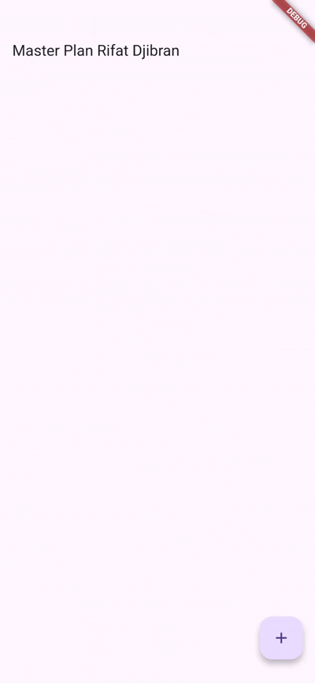
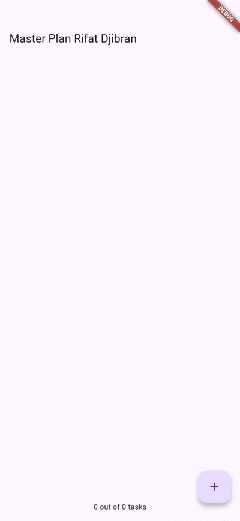
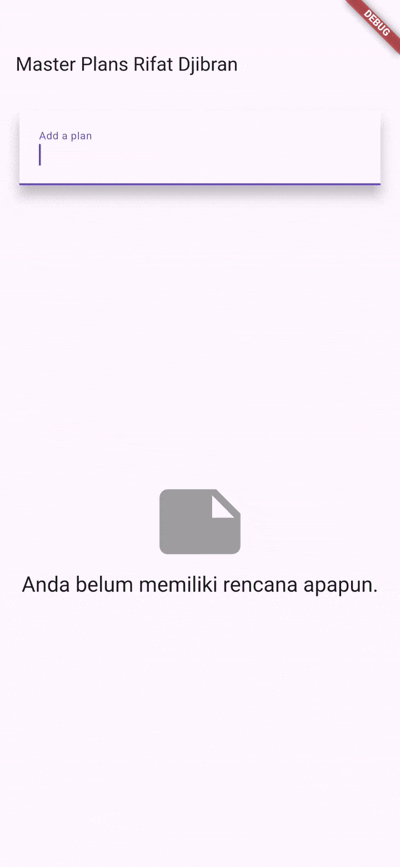

# Pemrograman Mobile
## Praktikum 10 - Dasar State Management

---

## Identitas

| Field    | Detail               |
|----------|----------------------|
| **Nama** | Rifat Djibran        |
| **NIM**  | 244107060138         |
| **Praktikum** | master_plan     |

---

## Struktur Project

```
pertemuan_10/
├── master_plan/
│   └── lib/
│       ├── models/
│       │   ├── task.dart
│       │   ├── plan.dart
│       │   └── data_layer.dart
│       ├── providers/
│       │   └── plan_provider.dart
│       ├── views/
│       │   ├── plan_screen.dart
│       │   └── plan_creator_screen.dart
│       └── main.dart
├── screenshots/
└── README.md
```

---

## Praktikum 1: Dasar State dengan Model-View

**Project:** `master_plan`

### Tujuan Visual

> GIF hasil Langkah 9 (sebelum scroll controller) dan Langkah 14 (hasil akhir) diletakkan di bawah ini setelah dijalankan di device/emulator.

---

### Langkah-langkah Praktikum

---

### Langkah 1 — Buat Project Baru

Project Flutter baru dibuat dengan nama `master_plan`, kemudian struktur folder dibuat secara manual di dalam `lib/` sesuai ketentuan:

```
lib/
├── models/
├── views/
└── main.dart
```

Folder `models/` digunakan untuk menyimpan semua kelas data (Task dan Plan), sedangkan `views/` untuk widget-widget tampilan. Pemisahan ini adalah inti dari konsep Model-View yang akan diterapkan di praktikum ini.

---

### Langkah 2 — Buat Model `task.dart`

File `lib/models/task.dart` dibuat sebagai representasi satu buah tugas. Class `Task` hanya memiliki dua atribut: `description` untuk teks tugas dan `complete` untuk status selesai atau tidaknya.

Kedua atribut menggunakan `final` karena Task bersifat immutable — setiap kali ada perubahan, kita tidak mengubah objek yang ada melainkan membuat objek Task baru. Ini sesuai dengan pendekatan unidirectional data flow di Flutter.

**`lib/models/task.dart`**
```dart
class Task {
  final String description;
  final bool complete;

  const Task({
    this.complete = false,
    this.description = '',
  });
}
```

---

### Langkah 3 — Buat File `plan.dart`

File `lib/models/plan.dart` dibuat untuk menyimpan satu rencana yang berisi nama plan dan daftar task-nya. `List<Task>` defaultnya adalah `const []` agar bisa digunakan di constructor `const`.

**`lib/models/plan.dart`**
```dart
import './task.dart';

class Plan {
  final String name;
  final List<Task> tasks;

  const Plan({this.name = '', this.tasks = const []});
}
```

---

### Langkah 4 — Buat File `data_layer.dart`

File `lib/models/data_layer.dart` dibuat sebagai single entry point untuk semua model. Tujuannya agar ketika ada widget yang butuh mengimpor model, cukup impor satu file ini saja, tidak perlu impor `task.dart` dan `plan.dart` secara terpisah.

Ini penting saat aplikasi berkembang — jika kita nanti menambah model baru (misal `Category`), cukup tambahkan satu baris `export` di sini dan semua widget otomatis bisa mengaksesnya tanpa perlu mengubah setiap file impor.

**`lib/models/data_layer.dart`**
```dart
export 'plan.dart';
export 'task.dart';
```

---

### Langkah 5 — Edit `main.dart`

`main.dart` diubah untuk menggunakan `PlanScreen` sebagai home. Saat ini `PlanScreen` belum dibuat (akan dibuat di langkah 6), jadi masih terjadi error sementara.

**`lib/main.dart`**
```dart
import 'package:flutter/material.dart';
import './views/plan_screen.dart';

void main() => runApp(const MasterPlanApp());

class MasterPlanApp extends StatelessWidget {
  const MasterPlanApp({super.key});

  @override
  Widget build(BuildContext context) {
    return MaterialApp(
      theme: ThemeData(primarySwatch: Colors.purple),
      home: const PlanScreen(),
    );
  }
}
```

---

### Langkah 6 — Buat `plan_screen.dart`

File `lib/views/plan_screen.dart` dibuat sebagai tampilan utama. Variabel `plan` di sini menyimpan state data plan yang aktif. Dibuat `const Plan()` karena di awal aplikasi belum ada data — plan masih kosong dengan nama kosong dan tasks kosong.

Alasan menggunakan `const` adalah agar Flutter bisa menggunakan instance yang sama di memori tanpa membuat objek baru setiap kali widget di-build, sehingga lebih efisien.

**`lib/views/plan_screen.dart`**
```dart
import '../models/data_layer.dart';
import 'package:flutter/material.dart';

class PlanScreen extends StatefulWidget {
  const PlanScreen({super.key});

  @override
  State<PlanScreen> createState() => _PlanScreenState();
}

class _PlanScreenState extends State<PlanScreen> {
  Plan plan = const Plan();

  @override
  Widget build(BuildContext context) {
    return Scaffold(
      // ganti 'Namaku' dengan nama panggilan kamu
      appBar: AppBar(title: const Text('Master Plan Namaku')),
      body: _buildList(),
      floatingActionButton: _buildAddTaskButton(),
    );
  }
}
```

---

### Langkah 7 — Buat Method `_buildAddTaskButton()`

Method ini membuat tombol FAB (Floating Action Button) yang saat ditekan akan menambah satu Task kosong ke dalam list. Karena model kita immutable, kita tidak bisa langsung `plan.tasks.add(...)`, melainkan harus membuat Plan baru dengan tasks yang sudah ditambah item baru di akhirnya.

```dart
Widget _buildAddTaskButton() {
  return FloatingActionButton(
    child: const Icon(Icons.add),
    onPressed: () {
      setState(() {
        plan = Plan(
          name: plan.name,
          tasks: List<Task>.from(plan.tasks)..add(const Task()),
        );
      });
    },
  );
}
```

---

### Langkah 8 — Buat Widget `_buildList()`

`ListView.builder` digunakan karena lebih efisien dibanding `ListView` biasa — ia hanya merender item yang sedang terlihat di layar, bukan semua item sekaligus. `itemBuilder` menghasilkan widget untuk setiap index.

```dart
Widget _buildList() {
  return ListView.builder(
    itemCount: plan.tasks.length,
    itemBuilder: (context, index) =>
        _buildTaskTile(plan.tasks[index], index),
  );
}
```

---

### Langkah 9 — Buat Widget `_buildTaskTile`

`ListTile` dibuat dengan `Checkbox` di bagian kiri dan `TextFormField` sebagai judul. Setiap perubahan (centang atau ketik) akan memicu `setState` yang membuat Plan baru dengan Task yang sudah diupdate pada index yang bersangkutan.

```dart
Widget _buildTaskTile(Task task, int index) {
  return ListTile(
    leading: Checkbox(
      value: task.complete,
      onChanged: (selected) {
        setState(() {
          plan = Plan(
            name: plan.name,
            tasks: List<Task>.from(plan.tasks)
              ..[index] = Task(
                description: task.description,
                complete: selected ?? false,
              ),
          );
        });
      },
    ),
    title: TextFormField(
      initialValue: task.description,
      onChanged: (text) {
        setState(() {
          plan = Plan(
            name: plan.name,
            tasks: List<Task>.from(plan.tasks)
              ..[index] = Task(
                description: text,
                complete: task.complete,
              ),
          );
        });
      },
    ),
  );
}
```

> — Jalankan aplikasi (F5), tambah beberapa task, centang salah satunya. Rekam sebagai GIF.

```
screenshots/p1_langkah9.gif
```


---

### Langkah 10 — Tambah Scroll Controller

Variabel `scrollController` ditambahkan tepat di bawah variabel `plan`. Penggunaan `late` karena nilainya baru diisi di `initState`, bukan saat deklarasi.

```dart
late ScrollController scrollController;
```

---

### Langkah 11 — Tambah Scroll Listener

`initState()` ditambahkan untuk menginisialisasi `scrollController`. Listener ditambahkan menggunakan cascade (`..addListener`) agar ketika pengguna mulai scroll, semua `TextField` kehilangan fokus dan keyboard otomatis disembunyikan.

```dart
@override
void initState() {
  super.initState();
  scrollController = ScrollController()
    ..addListener(() {
      FocusScope.of(context).requestFocus(FocusNode());
    });
}
```

**Kegunaan di lifecycle:** `initState` dipanggil sekali saat widget pertama kali dimasukkan ke widget tree. Ini tempat yang tepat untuk menginisialisasi resource seperti controller yang butuh hidup selama widget ada.

---

### Langkah 12 — Tambah Controller dan Keyboard Behavior ke ListView

`scrollController` disambungkan ke ListView, dan `keyboardDismissBehavior` disesuaikan per platform: di iOS keyboard langsung hilang saat drag, di Android harus manual (karena iOS lebih ketat soal UX keyboard).

```dart
Widget _buildList() {
  return ListView.builder(
    controller: scrollController,
    keyboardDismissBehavior: Theme.of(context).platform == TargetPlatform.iOS
        ? ScrollViewKeyboardDismissBehavior.onDrag
        : ScrollViewKeyboardDismissBehavior.manual,
    itemCount: plan.tasks.length,
    itemBuilder: (context, index) =>
        _buildTaskTile(plan.tasks[index], index),
  );
}
```

---

### Langkah 13 — Tambah Method `dispose()`

`dispose()` dipanggil otomatis oleh Flutter saat widget dihapus dari tree. Memanggil `scrollController.dispose()` di sini penting untuk melepas resource memory dan mencegah memory leak, terutama karena controller memiliki listener yang masih aktif.

```dart
@override
void dispose() {
  scrollController.dispose();
  super.dispose();
}
```

**Kegunaan di lifecycle:** `dispose` adalah pasangan dari `initState` — apa yang dibuat di `initState` harus dibersihkan di `dispose`. Urutan pemanggilan `super.dispose()` harus paling akhir.

---

### Langkah 14 — Hasil Akhir Praktikum 1

Lakukan **hot restart** (bukan hot reload) karena ada perubahan state awal aplikasi. Setelah restart, coba tambah beberapa task, isi teksnya, centang beberapa, lalu scroll ke bawah sambil keyboard terbuka untuk melihat keyboard otomatis menutup.

> — Rekam sebagai GIF untuk dokumentasi hasil akhir Praktikum 1.

```
screenshots/p1_hasil_akhir.gif
```

| Hasil Akhir Praktikum 1 |
|:-:|
|  |

---

## Tugas Praktikum 1

### Tugas 1 — Dokumentasi

Praktikum 1 telah diselesaikan dan didokumentasikan di atas beserta penjelasan setiap langkah. GIF diambil pada Langkah 9 (sebelum scroll controller) dan Langkah 14 (setelah scroll controller ditambahkan).

---

### Tugas 2 — Jelaskan Langkah 4

Langkah 4 membuat file `data_layer.dart` yang isinya hanya dua baris `export`. Tujuannya adalah membuat satu titik impor tunggal untuk semua model. Jadi daripada tiap widget harus impor `task.dart` dan `plan.dart` secara terpisah, cukup impor `data_layer.dart` saja. Ini juga memudahkan maintenance — kalau nanti ada model baru, cukup tambahkan di satu tempat ini.

---

### Tugas 3 — Mengapa Perlu Variabel `plan` di Langkah 6 dan Kenapa `const`?

Variabel `plan` dibutuhkan karena `PlanScreen` adalah `StatefulWidget` — artinya tampilan bisa berubah sesuai data, dan `plan` adalah sumber data yang digunakan oleh `_buildList()` dan `_buildTaskTile()`. Tanpa variabel ini, tidak ada tempat untuk menyimpan daftar tugas yang terus berkembang saat pengguna menambah task.

Dibuat `const Plan()` karena di awal belum ada data apapun. Penggunaan `const` memungkinkan Flutter menggunakan satu instance yang sama di memori — lebih hemat dibanding membuat `Plan()` baru setiap build.

---

### Tugas 4 — Penjelasan Langkah 9

> Lihat GIF `screenshots/p1_langkah9.gif`

Pada langkah ini saya membuat widget `_buildTaskTile` yang menghasilkan satu item list berupa `ListTile`. Di bagian kiri ada `Checkbox` untuk menandai task selesai, dan di bagian tengah ada `TextFormField` untuk mengisi deskripsi tugas. Setiap perubahan (baik centang maupun teks) langsung memperbarui state via `setState` dengan membuat objek `Plan` dan `Task` baru yang menggantikan data lama.

---

### Tugas 5 — Kegunaan `initState()` dan `dispose()` dalam Lifecycle

`initState()` adalah metode yang dipanggil satu kali saat widget baru pertama kali dibuat dan dimasukkan ke widget tree. Di sini saya menginisialisasi `scrollController` beserta listenernya karena controller perlu siap sebelum widget ditampilkan.

`dispose()` adalah metode yang dipanggil saat widget hendak dihapus dari tree secara permanen. Di sini `scrollController.dispose()` dipanggil untuk melepas memori dan membersihkan listener yang masih aktif. Kalau tidak dibersihkan, listener bisa tetap berjalan meski widget sudah tidak ada, yang menyebabkan memory leak atau bahkan crash karena mengakses context yang sudah tidak valid.

---

---

## Praktikum 2: Mengelola Data Layer dengan InheritedWidget dan InheritedNotifier

**Project:** `master_plan` (lanjutan)

### Tujuan Visual

> GIF hasil Langkah 9 diletakkan di sini setelah dijalankan di device/emulator.

---

### Langkah-langkah Praktikum

---

### Langkah 1 — Buat `plan_provider.dart`

Folder `lib/providers/` dibuat, lalu file `plan_provider.dart` dibuat di dalamnya. `PlanProvider` mewarisi `InheritedNotifier` yang merupakan subclass dari `InheritedWidget`, ditambah dengan kemampuan untuk memberitahu (notify) semua widget yang bergantung padanya saat nilai berubah.

**`lib/providers/plan_provider.dart`**
```dart
import 'package:flutter/material.dart';
import '../models/data_layer.dart';

class PlanProvider extends InheritedNotifier<ValueNotifier<Plan>> {
  const PlanProvider({
    super.key,
    required Widget child,
    required ValueNotifier<Plan> notifier,
  }) : super(child: child, notifier: notifier);

  static ValueNotifier<Plan> of(BuildContext context) {
    return context
        .dependOnInheritedWidgetOfExactType<PlanProvider>()!
        .notifier!;
  }
}
```

---

### Langkah 2 — Edit `main.dart`

`PlanScreen` sekarang dibungkus dengan `PlanProvider` agar semua widget di bawahnya bisa mengakses data plan lewat context.

**`lib/main.dart`** (versi Praktikum 2)
```dart
import 'package:flutter/material.dart';
import './views/plan_screen.dart';
import './providers/plan_provider.dart';
import './models/data_layer.dart';

void main() => runApp(const MasterPlanApp());

class MasterPlanApp extends StatelessWidget {
  const MasterPlanApp({super.key});

  @override
  Widget build(BuildContext context) {
    return MaterialApp(
      theme: ThemeData(primarySwatch: Colors.purple),
      home: PlanProvider(
        notifier: ValueNotifier<Plan>(const Plan()),
        child: const PlanScreen(),
      ),
    );
  }
}
```

---

### Langkah 3 — Tambah Method pada Model `plan.dart`

Dua getter ditambahkan ke class `Plan` untuk menghitung progres tugas. `completedCount` menghitung berapa task yang sudah dicentang, dan `completenessMessage` menghasilkan teks ringkas seperti `"2 out of 5 tasks"` untuk ditampilkan di footer.

Ini dilakukan di layer model (bukan di view) agar logika bisnis tidak tersebar di mana-mana — view cukup memanggil `plan.completenessMessage` tanpa perlu tahu cara menghitungnya.

**`lib/models/plan.dart`** (versi Praktikum 2)
```dart
import './task.dart';

class Plan {
  final String name;
  final List<Task> tasks;

  const Plan({this.name = '', this.tasks = const []});

  int get completedCount => tasks.where((task) => task.complete).length;

  String get completenessMessage =>
      '$completedCount out of ${tasks.length} tasks';
}
```

---

### Langkah 4 — Hapus Deklarasi Variabel `plan`

Variabel `Plan plan = const Plan()` di `_PlanScreenState` dihapus karena data sekarang dikelola oleh `PlanProvider`, bukan disimpan lokal di dalam State. Ini akan menyebabkan error sementara yang akan diselesaikan di langkah 5–9.

---

### Langkah 5 — Edit `_buildAddTaskButton`

Method menerima `BuildContext` sebagai parameter agar bisa mengakses `PlanProvider`. Data plan sekarang dibaca dari dan ditulis ke `planNotifier.value` — tidak ada lagi `setState` karena `ValueNotifier` akan otomatis memberitahu widget yang mendengarkannya.

```dart
Widget _buildAddTaskButton(BuildContext context) {
  ValueNotifier<Plan> planNotifier = PlanProvider.of(context);
  return FloatingActionButton(
    child: const Icon(Icons.add),
    onPressed: () {
      Plan currentPlan = planNotifier.value;
      planNotifier.value = Plan(
        name: currentPlan.name,
        tasks: List<Task>.from(currentPlan.tasks)..add(const Task()),
      );
    },
  );
}
```

---

### Langkah 6 — Edit `_buildTaskTile`

Sama seperti langkah 5, sekarang pakai `PlanProvider` sebagai sumber data. `setState` tidak lagi diperlukan karena pembaruan dilakukan melalui `planNotifier.value`.

```dart
Widget _buildTaskTile(Task task, int index, BuildContext context) {
  ValueNotifier<Plan> planNotifier = PlanProvider.of(context);
  return ListTile(
    leading: Checkbox(
      value: task.complete,
      onChanged: (selected) {
        Plan currentPlan = planNotifier.value;
        planNotifier.value = Plan(
          name: currentPlan.name,
          tasks: List<Task>.from(currentPlan.tasks)
            ..[index] = Task(
              description: task.description,
              complete: selected ?? false,
            ),
        );
      },
    ),
    title: TextFormField(
      initialValue: task.description,
      onChanged: (text) {
        Plan currentPlan = planNotifier.value;
        planNotifier.value = Plan(
          name: currentPlan.name,
          tasks: List<Task>.from(currentPlan.tasks)
            ..[index] = Task(
              description: text,
              complete: task.complete,
            ),
        );
      },
    ),
  );
}
```

---

### Langkah 7 — Edit `_buildList`

Parameter `Plan plan` ditambahkan agar method ini bisa menerima data plan yang sudah di-listen dari `ValueListenableBuilder`.

```dart
Widget _buildList(Plan plan) {
  return ListView.builder(
    controller: scrollController,
    keyboardDismissBehavior: Theme.of(context).platform == TargetPlatform.iOS
        ? ScrollViewKeyboardDismissBehavior.onDrag
        : ScrollViewKeyboardDismissBehavior.manual,
    itemCount: plan.tasks.length,
    itemBuilder: (context, index) =>
        _buildTaskTile(plan.tasks[index], index, context),
  );
}
```

---

### Langkah 8 — Wrap `_buildList` dengan `Column` dan `Expanded`

`_buildList` dibungkus `Expanded` agar ListView mengisi sisa ruang layar, dan `Column` digunakan sebagai container yang nanti akan menampung juga widget footer di bawahnya.

---

### Langkah 9 — Tambah Widget `SafeArea` dan Update `build`

`ValueListenableBuilder` digunakan agar widget hanya di-rebuild saat nilai `planNotifier` berubah — lebih efisien dari `setState`. `SafeArea` di bagian bawah memastikan teks progress tidak tertutup notch atau navigation bar device.

**`lib/views/plan_screen.dart`** — method `build` (versi Praktikum 2)
```dart
@override
Widget build(BuildContext context) {
  return Scaffold(
    appBar: AppBar(title: const Text('Master Plan')),
    body: ValueListenableBuilder<Plan>(
      valueListenable: PlanProvider.of(context),
      builder: (context, plan, child) {
        return Column(
          children: [
            Expanded(child: _buildList(plan)),
            SafeArea(child: Text(plan.completenessMessage)),
          ],
        );
      },
    ),
    floatingActionButton: _buildAddTaskButton(context),
  );
}
```

> — Jalankan aplikasi, tambah beberapa task, centang beberapa, lihat footer progress di bawah. Rekam sebagai GIF.

```
screenshots/p2_langkah9.gif
```

| Hasil Praktikum 2 — Footer Progress |
|:-:|
|  |

---

## Tugas Praktikum 2

### Tugas 1 — Dokumentasi

Praktikum 2 telah diselesaikan dengan memisahkan data plan dari state lokal `PlanScreen` ke `PlanProvider`. GIF diambil setelah Langkah 9 selesai diterapkan.

---

### Tugas 2 — Apa itu `InheritedWidget` dan Mengapa Pakai `InheritedNotifier`?

`InheritedWidget` adalah jenis widget yang bisa "meloloskan" data ke semua widget keturunannya di dalam widget tree tanpa perlu passing manual lewat constructor. Widget di bawahnya bisa mengakses data ini lewat `context.dependOnInheritedWidgetOfExactType<...>()`.

Yang dipakai di Langkah 1 adalah `InheritedNotifier`, bukan `InheritedWidget` biasa. Alasannya karena `InheritedNotifier` sudah terintegrasi dengan `ValueNotifier` — setiap kali `notifier.value` berubah, semua widget yang bergantung padanya otomatis di-rebuild. Kalau hanya pakai `InheritedWidget` biasa, kita harus mengatur mekanisme rebuild secara manual.

---

### Tugas 3 — Maksud Method di Langkah 3

Dua getter ditambahkan ke class `Plan`:

- `completedCount` — menghitung berapa Task yang sudah `complete == true` menggunakan `.where()`.
- `completenessMessage` — menghasilkan string ringkas dari hasil hitungan itu.

Alasan ini diletakkan di model (bukan di view) adalah untuk memisahkan logika bisnis dari tampilan. View cukup memanggil `plan.completenessMessage` tanpa perlu tahu cara menghitungnya. Kalau nanti format pesannya mau diubah, cukup ubah di model tanpa menyentuh view sama sekali.

---

### Tugas 4 — Penjelasan Langkah 9

> Lihat GIF `screenshots/p2_langkah9.gif`

Di langkah ini saya menambahkan `ValueListenableBuilder` sebagai pembungkus body Scaffold. Builder ini akan otomatis merender ulang Column (yang berisi ListView dan footer) setiap kali data plan berubah. Di bagian bawah Column, saya tambahkan `SafeArea` yang berisi teks `plan.completenessMessage` — teks ini menampilkan berapa task yang sudah selesai dari total keseluruhan. `SafeArea` dipakai agar teks tidak tertutup navigation bar di bagian bawah device.

---

---

## Praktikum 3: Membuat State di Multiple Screens

**Project:** `master_plan` (lanjutan)

### Tujuan Visual

> GIF hasil Langkah 14 diletakkan di sini setelah dijalankan di device/emulator.

---

### Langkah-langkah Praktikum

---

### Langkah 1 — Edit `PlanProvider`

`PlanProvider` diubah dari menangani satu `Plan` menjadi `List<Plan>` agar bisa mendukung banyak rencana sekaligus. Semua generic type parameter diupdate dari `ValueNotifier<Plan>` menjadi `ValueNotifier<List<Plan>>`.

**`lib/providers/plan_provider.dart`** (versi final)
```dart
import 'package:flutter/material.dart';
import '../models/data_layer.dart';

class PlanProvider extends InheritedNotifier<ValueNotifier<List<Plan>>> {
  const PlanProvider({
    super.key,
    required Widget child,
    required ValueNotifier<List<Plan>> notifier,
  }) : super(child: child, notifier: notifier);

  static ValueNotifier<List<Plan>> of(BuildContext context) {
    return context
        .dependOnInheritedWidgetOfExactType<PlanProvider>()!
        .notifier!;
  }
}
```

---

### Langkah 2 — Edit `main.dart`

`PlanProvider` dipindahkan keluar dari `MaterialApp` (di atas-nya) agar state bisa diakses di semua screen, termasuk screen yang di-push lewat Navigator. `home` diubah ke `PlanCreatorScreen` yang akan dibuat di Langkah 9.

**`lib/main.dart`** (versi final)
```dart
import 'package:flutter/material.dart';
import './views/plan_creator_screen.dart';
import './providers/plan_provider.dart';
import './models/data_layer.dart';

void main() => runApp(const MasterPlanApp());

class MasterPlanApp extends StatelessWidget {
  const MasterPlanApp({super.key});

  @override
  Widget build(BuildContext context) {
    return PlanProvider(
      notifier: ValueNotifier<List<Plan>>(const []),
      child: MaterialApp(
        title: 'State management app',
        theme: ThemeData(primarySwatch: Colors.blue),
        home: const PlanCreatorScreen(),
      ),
    );
  }
}
```

---

### Langkah 3 — Edit `plan_screen.dart` — Tambah Atribut `plan`

`PlanScreen` sekarang perlu tahu plan mana yang ditampilkan, karena ada banyak plan. Maka atribut `plan` ditambahkan ke constructor agar parent bisa meneruskan plan yang dipilih.

```dart
final Plan plan;
const PlanScreen({super.key, required this.plan});
```

---

### Langkah 4 — Error Sementara

Perubahan pada `PlanProvider` menyebabkan error di `plan_screen.dart` karena semua pemanggilan `PlanProvider.of(context)` sekarang mengembalikan `ValueNotifier<List<Plan>>` bukan `ValueNotifier<Plan>` lagi. Error ini diselesaikan di langkah-langkah berikutnya.

---

### Langkah 5 — Tambah Getter `plan`

Getter menggantikan variabel plan lokal. Karena `PlanScreen` sekarang menerima `plan` dari luar lewat constructor, kita akses melalui `widget.plan`. Penggunaan getter membuat kode lebih bersih karena tidak perlu menyimpan salinan plan lokal.

```dart
Plan get plan => widget.plan;
```

---

### Langkah 6 — `initState()` Tetap Sama

Tidak ada perubahan di `initState`. Scroll controller tetap diinisialisasi dengan cara yang sama.

---

### Langkah 7 — Update Method `build` dan `_buildAddTaskButton`

Method `build` diupdate untuk menggunakan `List<Plan>` dan mencari plan yang aktif berdasarkan nama. `_buildAddTaskButton` juga diupdate untuk mencari index plan di list sebelum mengupdate nilainya.

**`lib/views/plan_screen.dart`** — method `build` (versi final)
```dart
@override
Widget build(BuildContext context) {
  ValueNotifier<List<Plan>> plansNotifier = PlanProvider.of(context);
  return Scaffold(
    appBar: AppBar(title: Text(plan.name)),
    body: ValueListenableBuilder<List<Plan>>(
      valueListenable: plansNotifier,
      builder: (context, plans, child) {
        Plan currentPlan = plans.firstWhere((p) => p.name == plan.name);
        return Column(
          children: [
            Expanded(child: _buildList(currentPlan)),
            SafeArea(child: Text(currentPlan.completenessMessage)),
          ],
        );
      },
    ),
    floatingActionButton: _buildAddTaskButton(context),
  );
}
```

---

### Langkah 8 — Update `_buildTaskTile`

`_buildTaskTile` diupdate untuk menggunakan `List<Plan>` — mencari index plan yang sedang aktif sebelum mengupdate task di dalamnya.

---

### Langkah 9 — Buat `plan_creator_screen.dart`

File baru `lib/views/plan_creator_screen.dart` dibuat sebagai screen utama yang muncul pertama kali. Di screen ini pengguna bisa membuat plan baru dan melihat daftar semua plan yang sudah dibuat.

---

### Langkah 10 — Tambah `TextEditingController`

`textController` ditambahkan untuk mengelola input text field di form tambah plan. `dispose()` dipanggil untuk membersihkan controller saat widget dihapus.

```dart
final textController = TextEditingController();

@override
void dispose() {
  textController.dispose();
  super.dispose();
}
```

---

### Langkah 11 — Method `build` di `PlanCreatorScreen`

Method `build` menyusun tampilan dengan `Column` yang berisi `_buildListCreator` di atas dan `_buildMasterPlans` yang mengisi sisa ruang layar.

```dart
@override
Widget build(BuildContext context) {
  return Scaffold(
    appBar: AppBar(title: const Text('Master Plans Namaku')),
    body: Column(
      children: [
        _buildListCreator(),
        Expanded(child: _buildMasterPlans()),
      ],
    ),
  );
}
```

---

### Langkah 12 — Widget `_buildListCreator`

`TextField` dibungkus `Material` dengan elevation untuk memberikan efek shadow. `onEditingComplete` terhubung ke method `addPlan` agar saat user tekan Enter/Done, plan langsung ditambahkan.

```dart
Widget _buildListCreator() {
  return Padding(
    padding: const EdgeInsets.all(20.0),
    child: Material(
      color: Theme.of(context).cardColor,
      elevation: 10,
      child: TextField(
        controller: textController,
        decoration: const InputDecoration(
          labelText: 'Add a plan',
          contentPadding: EdgeInsets.all(20),
        ),
        onEditingComplete: addPlan,
      ),
    ),
  );
}
```

---

### Langkah 13 — Void `addPlan()`

Method ini membaca teks dari controller, membuat objek `Plan` baru, menambahkannya ke notifier, lalu membersihkan field dan menutup keyboard.

```dart
void addPlan() {
  final text = textController.text;
  if (text.isEmpty) return;
  final plan = Plan(name: text, tasks: []);
  ValueNotifier<List<Plan>> planNotifier = PlanProvider.of(context);
  planNotifier.value = List<Plan>.from(planNotifier.value)..add(plan);
  textController.clear();
  FocusScope.of(context).requestFocus(FocusNode());
  setState(() {});
}
```

---

### Langkah 14 — Widget `_buildMasterPlans`

Widget ini menampilkan daftar semua plan yang sudah dibuat. Kalau belum ada plan, ditampilkan icon dan teks kosong. Kalau sudah ada, ditampilkan `ListView` dengan `ListTile` per plan. Tap pada `ListTile` akan melakukan `Navigator.push` ke `PlanScreen` sambil meneruskan plan yang dipilih.

**`lib/views/plan_creator_screen.dart`** (versi final)
```dart
Widget _buildMasterPlans() {
  ValueNotifier<List<Plan>> planNotifier = PlanProvider.of(context);
  List<Plan> plans = planNotifier.value;
  if (plans.isEmpty) {
    return Column(
      mainAxisAlignment: MainAxisAlignment.center,
      children: <Widget>[
        const Icon(Icons.note, size: 100, color: Colors.grey),
        Text(
          'Anda belum memiliki rencana apapun.',
          style: Theme.of(context).textTheme.headlineSmall,
        ),
      ],
    );
  }
  return ListView.builder(
    itemCount: plans.length,
    itemBuilder: (context, index) {
      final plan = plans[index];
      return ListTile(
        title: Text(plan.name),
        subtitle: Text(plan.completenessMessage),
        onTap: () {
          Navigator.of(context).push(
            MaterialPageRoute(
              builder: (_) => PlanScreen(plan: plan),
            ),
          );
        },
      );
    },
  );
}
```

> 📸 **SCREENSHOT DI SINI** — Jalankan aplikasi, tambah beberapa plan, tap salah satunya, tambah tasks di dalamnya. Rekam sebagai GIF.

```
screenshots/p3_langkah14.gif
```

| Hasil Praktikum 3 — Multi Screen |
|:-:|
|  |

---

## Tugas Praktikum 3

### Tugas 1 — Dokumentasi

Praktikum 3 telah diselesaikan dengan menambahkan screen kedua (`PlanCreatorScreen`) dan mengupdate `PlanProvider` agar mendukung banyak plan. GIF diambil setelah Langkah 14 selesai diterapkan.

---

### Tugas 2 — Penjelasan Diagram

Diagram di soal menunjukkan dua kondisi widget tree sebelum dan sesudah `Navigator.push`:

**Sebelum push (kiri — biru):**
```
MaterialApp → PlanProvider → PlanCreatorScreen → Column → [TextField, Expanded → ListView]
```
`PlanCreatorScreen` adalah screen awal. `PlanProvider` ada di atas `MaterialApp` sehingga bisa diakses dari mana saja.

**Sesudah push (kanan — hijau):**
```
MaterialApp → PlanScreen → Scaffold → Column → [Expanded → ListView, SafeArea → Text]
```
Saat user mengetuk salah satu plan di `PlanCreatorScreen`, `Navigator.push` membuat screen baru (`PlanScreen`) dan menempatkannya di atas stack navigasi. `PlanScreen` tetap bisa mengakses `PlanProvider` karena provider tersebut berada di atas `MaterialApp` dalam widget tree — tidak terputus meskipun berpindah screen.

Ini adalah konsep "Lift State Up": dengan meletakkan `PlanProvider` di atas `MaterialApp`, state dapat dibagi ke semua screen tanpa perlu mengirim data lewat constructor Navigator.

---

### Tugas 3 — Penjelasan Langkah 14

> Lihat GIF `screenshots/p3_langkah14.gif`

Di langkah ini saya membuat widget `_buildMasterPlans` yang menjadi inti dari screen pertama. Widget ini membaca list plan dari `PlanProvider` dan menampilkannya sebagai `ListView`. Setiap item plan menampilkan nama plan di baris utama dan pesan progress (misal "0 out of 0 tasks") di subtitle. Saat item ditekan, aplikasi navigasi ke `PlanScreen` dengan plan yang dipilih. Kalau belum ada plan sama sekali, ditampilkan icon dan teks panduan agar user tahu cara memulai.

---

## Kesimpulan

Pada praktikum ini dipelajari tiga konsep utama manajemen state di Flutter:

1. **Model-View separation** — memisahkan kelas data (Task, Plan) dari widget tampilan. Model tidak mewarisi apapun dari Flutter framework, sedangkan View fokus pada tampilan UI.

2. **InheritedNotifier** — cara mengelola state di luar widget tree tanpa perlu passing data manual lewat constructor. `PlanProvider` mengekspos data ke seluruh subtree di bawahnya, dan widget yang bergantung padanya otomatis rebuild saat nilai berubah.

3. **State di multiple screens** — dengan meletakkan `PlanProvider` di atas `MaterialApp`, state tetap bisa diakses meskipun sudah berpindah screen via `Navigator.push`. Ini adalah penerapan nyata dari prinsip "Lift State Up" yang populer di komunitas Flutter.