## Praktikum 1 

# Langkah 2

Hasil yang Terjadi
Saat dijalankan, kode tersebut akan menghasilkan **error**.
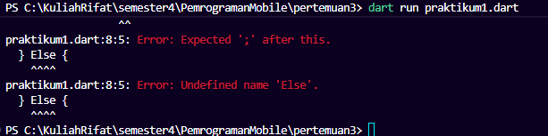

### Penyebab Error

Dart bersifat **case-sensitive**, sehingga:

* `If` seharusnya `if`
* `Else` seharusnya `else`

Keyword di Dart harus ditulis dengan huruf kecil semua.

### Output yang muncul:
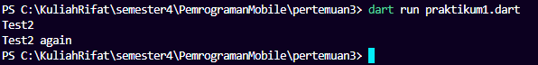

* Blok `if / else if / else` hanya menjalankan satu kondisi yang bernilai true.
* `if` yang berdiri sendiri akan tetap dievaluasi kembali.
* Dart sangat sensitif terhadap huruf besar dan kecil (case-sensitive).

---

# Langkah 3

Apa yang Terjadi?
Kode tersebut menghasilkan **error**.
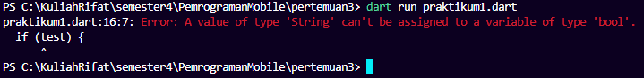

Penyebab Error :

* `if` hanya menerima ekspresi bertipe `bool` (`true` atau `false`).
* `"true"` adalah `String`, bukan `bool`.
* Dart tidak melakukan konversi tipe otomatis (type coercion).

---

# Perbaikan 
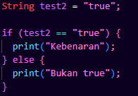

## Praktikum 2 

# Langkah 1

Ketik atau salin kode berikut ke dalam fungsi `main()`:
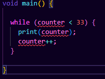

# Langkah 2

Saat dijalankan, kode menghasilkan **error**.

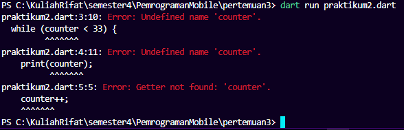

Penyebab Error :

Variabel `counter` belum dideklarasikan.

Dart adalah bahasa yang ketat terhadap deklarasi variabel.  
Setiap variabel harus didefinisikan terlebih dahulu sebelum digunakan.

Perbaikan:

Tambahkan deklarasi variabel sebelum perulangan:
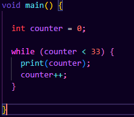

# Output

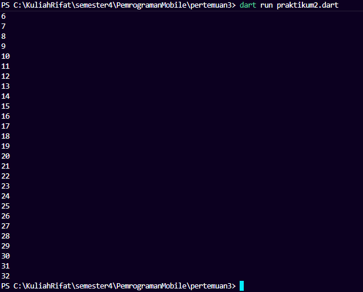

Program akan mencetak angka dari 0 sampai 32.

Penjelasan:
- `counter` dimulai dari 0
- Selama `counter < 33`, loop berjalan
- Setiap iterasi, `counter` bertambah 1
- Loop berhenti saat `counter` mencapai 33

# Langkah 3

Tambahkan kode berikut setelah while:
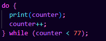

## 🔎 Apa yang Terjadi?

Program akan melanjutkan mencetak angka dari 33 sampai 76.

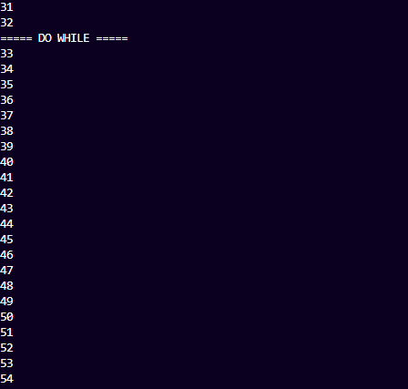

---

# Perbedaan `while` dan `do-while`

### while
- Kondisi dicek di awal.
- Jika kondisi false sejak awal, loop tidak akan dijalankan sama sekali.

### do-while
- Blok kode dijalankan terlebih dahulu.
- Kondisi dicek di akhir.
- Minimal akan berjalan satu kali meskipun kondisi awal false.

## Praktikum 3 

# Langkah 1

Kode awal:
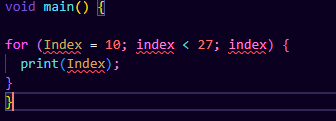

# Langkah 2

Kode menghasilkan error.

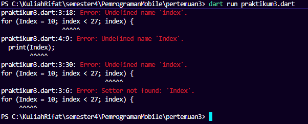

## Penyebab Error

1. Variabel `Index` belum dideklarasikan.
2. Perbedaan huruf besar-kecil (`Index` ≠ `index`).
3. Tidak ada increment (`index++`).
4. Tidak ada tipe data (`int`).

# Perbaikan
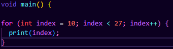

## Output

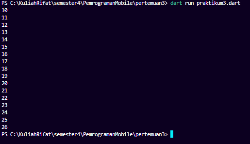

Program mencetak angka dari 10 sampai 26.

---

# Langkah 3

Kode tambahan :

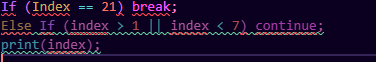

## Error yang Terjadi

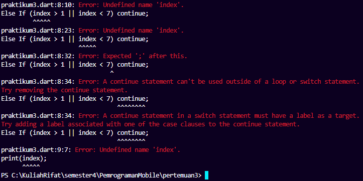

- `If` harus `if`
- `Else If` harus `else if`
- `Index` dan `index` berbeda
- Operator logika `||` membuat kondisi selalu true
- Tidak menggunakan blok `{}`

---

# Perbaikan Final

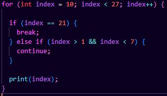

## Output Setelah Perbaikan

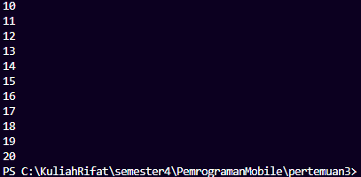

Program mencetak angka 10 sampai 20, lalu berhenti saat mencapai 21 karena memanggil `break`.

---

