# Praktikum 1 

## Langkah 1 

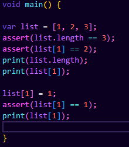

### Hasil Output

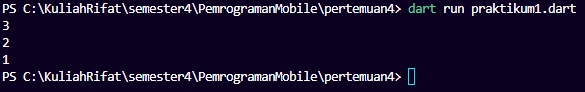

Program berjalan normal tanpa error.

## Langkah 2 – Apa yang Terjadi?

Saat kode dijalankan:

- Program menampilkan panjang list
- Menampilkan isi index ke-1
- Setelah diubah, nilai index ke-1 berubah dari 2 menjadi 1
- Tidak terjadi error

## Langkah 3 

List diubah menjadi:
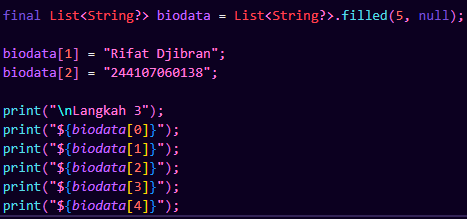

### Hasil Output
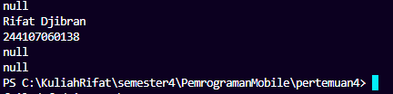

Tidak terjadi error karena:
- Kode mendefinisikan tipe data secara eksplisit
- Menggunakan String agar bisa menyimpan null
- final hanya membuat variabel tidak bisa diganti ke list baru, tetapi isi list tetap bisa diubah.

# Praktikum 2 

## Langkah 1

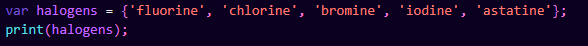

### Hasil Output

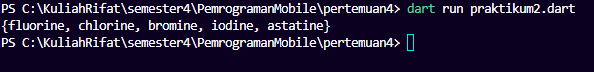

Program berhasil dijalankan dan menampilkan isi dari variabel `halogens`.

Variabel tersebut bertipe **Set**, yaitu struktur data yang digunakan untuk menyimpan kumpulan nilai unik (tidak boleh ada duplikasi).

Ketika dijalankan, program mencetak semua elemen yang ada di dalam Set tersebut ke console.

---

## Langkah 2 – Apa yang Terjadi?

Saat kode dijalankan:

- Program membuat sebuah **Set bernama `halogens`**
- Set tersebut berisi beberapa elemen berupa nama unsur kimia
- Program kemudian mencetak isi Set ke console

---

## Langkah 3

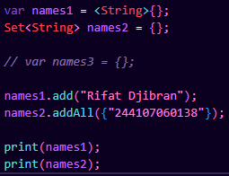

### Hasil Output

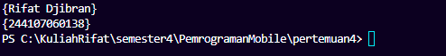

Pada langkah ini dibuat tiga variabel:

- `names1` bertipe **Set<String>**
- `names2` bertipe **Set<String>**
- `names3` sebenarnya membuat **Map**, bukan Set

Karena praktikum ini fokus pada **Set**, maka variabel `names3` dihapus.

Kemudian dilakukan penambahan data:

- `names1` menggunakan fungsi `.add()`
- `names2` menggunakan fungsi `.addAll()`

`.add()` digunakan untuk menambahkan **satu elemen**, sedangkan `.addAll()` digunakan untuk menambahkan **lebih dari satu elemen dalam bentuk collection**.

Program kemudian mencetak isi dari kedua Set tersebut ke console.

# Praktikum 3 

## Langkah 1

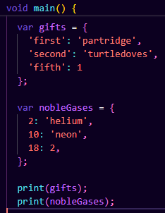

### Hasil Output

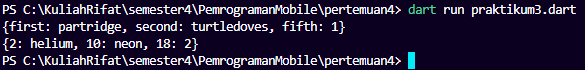

Program berhasil dijalankan dan menampilkan isi dari dua variabel yaitu `gifts` dan `nobleGases`.

Kedua variabel tersebut bertipe **Map**, yaitu struktur data yang menyimpan pasangan **key dan value**.

---

## Langkah 2 – Apa yang Terjadi?

Saat kode dijalankan:

- Variabel `gifts` menyimpan data dengan **key bertipe String**
- Variabel `nobleGases` menyimpan data dengan **key bertipe integer**
- Program mencetak isi Map ke console

Namun terdapat inkonsistensi tipe data pada value karena terdapat nilai integer pada beberapa elemen. Oleh karena itu value diperbaiki agar menggunakan tipe data yang sama yaitu String.

---

## Langkah 3

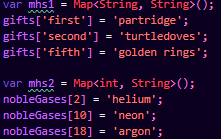

### Hasil Output

Tidak terjadi apa apa karena script tidak mencetak apa apa maka perlu ditambahkan print seperti dibawah ini
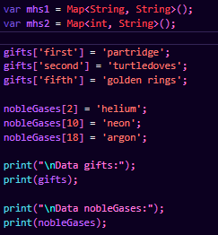

Maka Hasil Nya Seperti ini 
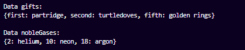

Pada langkah ini dibuat dua Map baru yaitu:

- `mhs1` dengan tipe `Map<String, String>`
- `mhs2` dengan tipe `Map<int, String>`

Kemudian ditambahkan beberapa elemen menggunakan pasangan **key dan value**.

Selain itu juga ditambahkan **nama dan NIM** pada setiap variabel Map (`gifts`, `nobleGases`, `mhs1`, dan `mhs2`).
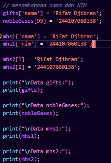

Program kemudian mencetak seluruh isi Map tersebut ke console.
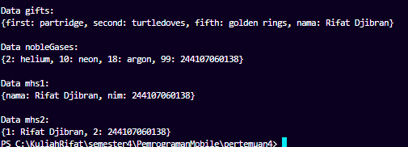

Map digunakan untuk menyimpan data dalam bentuk pasangan **key → value**, sehingga memudahkan pencarian data berdasarkan key yang dimiliki.

# Praktikum 4: 

## Langkah 1 & 2

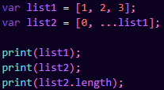

### Hasil Output
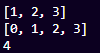

**Apa yang terjadi?**
Awalnya terjadi **error** karena variabel `list1` pada baris `print(list1)` belum didefinisikan (terdapat *typo* dari variabel `list` yang dibuat sebelumnya).

**Perbaikan:**
Mengubah `print(list1)` menjadi `print(list)` atau mendefinisikan `list1` terlebih dahulu. Setelah diperbaiki, program menampilkan isi list dan panjangnya menggunakan **Spread Operator** (`...`) yang berfungsi menyisipkan elemen list ke dalam list lain.

---

## Langkah 3

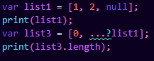

### Hasil Output
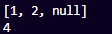

**Apa yang terjadi?**
Terjadi error jika `list1` tidak diinisialisasi atau jika variabel tidak dideklarasikan dengan benar sebelum digunakan. Penggunaan `...?` (Nullable Spread Operator) sangat penting di sini untuk mencegah *crash* jika `list1` bernilai `null`.

**Penambahan NIM:**
Saya menambahkan variabel berisi NIM saya dan menggabungkannya ke dalam `list3` menggunakan Spread Operator.
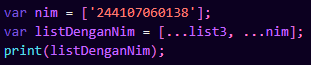

dan menghasilkan output

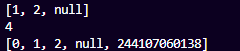

---

## Langkah 4

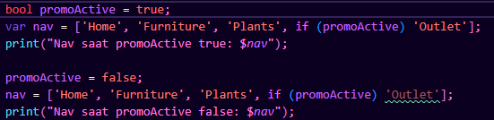

### Hasil Output
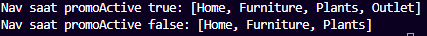

**Apa yang terjadi?**
Program akan error jika variabel `promoActive` belum dideklarasikan

**Hasil Kondisi:**
* **Jika `true`**: Item `'Outlet'` akan ditambahkan ke dalam List `nav`.
* **Jika `false`**: Item `'Outlet'` tidak akan muncul di dalam List.

---

## Langkah 5

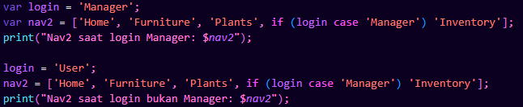

### Hasil Output
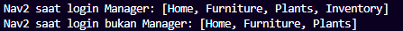

**Apa yang terjadi?**

* Jika variabel `login` bernilai `'Manager'`, maka item `'Inventory'` akan masuk ke dalam List `nav2`.
* Jika `login` diubah menjadi nilai lain, maka `'Inventory'` tidak akan muncul. Ini adalah cara inovatif untuk mengatur konten list secara kondisional tanpa blok `if-else` yang berantakan.

---

## Langkah 6

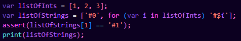

### Hasil Output

**Apa yang terjadi?**
Program menggunakan **Collection For** untuk melakukan iterasi langsung di dalam deklarasi list.
* Variabel `listOfInts` diiterasi, dan setiap nilainya diubah menjadi string dengan format `'#$i'`.
* `assert` digunakan untuk memastikan kondisi tertentu benar.

**Manfaat Collection For:**
Collection For meningkatkan efisiensi pengembangan dengan memungkinkan iterasi dan transformasi data secara deklaratif langsung di dalam inisialisasi list, sehingga menghasilkan struktur kode yang lebih ringkas dan dinamis terutama pada widget tree Flutter

# Praktikum 5

## Langkah 1 & 2

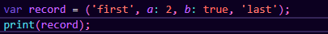

### Hasil Output
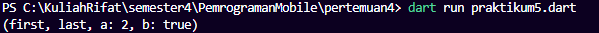

**Apa yang terjadi?**
Program berhasil mencetak objek **Record**. Record di Dart 3 memungkinkan kita menyimpan sekumpulan nilai dengan tipe data berbeda dalam satu variabel secara ringkas. Pada contoh ini, record berisi kombinasi *positional fields* (`'first'`, `'last'`) dan *named fields* (`a: 2`, `b: true`).

---

## Langkah 3

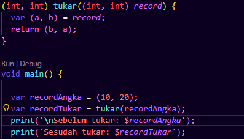

### Hasil Output
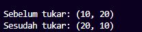

**Apa yang terjadi?**
Program menjalankan fungsi `tukar` yang menerima parameter record berupa dua integer `(int, int)`. Di dalam fungsi, dilakukan proses **destructuring** untuk mengambil nilai, lalu mengembalikannya dalam posisi terbalik. 

**Perbaikan:**
Saya memanggil fungsi `tukar()` di dalam `main()` dengan argumen sebuah record angka, sehingga proses pertukaran nilai terlihat jelas pada *console*.

---

## Langkah 4

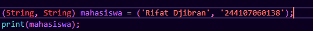

### Hasil Output
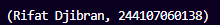

**Apa yang terjadi?**
Awalnya terjadi error karena variabel `mahasiswa` dipanggil oleh fungsi `print` sebelum diinisialisasi nilainya (*Non-nullable variable must be assigned before it can be used*).

**Perbaikan:**
Saya melakukan inisialisasi pada variabel `mahasiswa` dengan tipe `(String, String)` yang berisi **Nama dan NIM** saya. Record ini bertindak sebagai kontainer data yang efisien tanpa perlu membuat *class* baru.

---

## Langkah 5

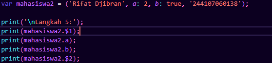

### Hasil Output
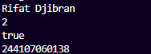

**Apa yang terjadi?**
Program menunjukkan cara mengakses nilai di dalam Record dengan dua metode:
* **Positional Fields:** Diakses menggunakan operator `$` diikuti urutan indeksnya (misal: `$1`, `$2`).
* **Named Fields:** Diakses langsung menggunakan nama labelnya (misal: `.a` atau `.b`).

**Modifikasi:**
Saya mengganti isi record dengan **Nama dan NIM** saya. Hasilnya, akses field `$1` berhasil mencetak Nama dan `$2` berhasil mencetak NIM saya secara akurat.