Pemrograman Mobile

## Identitas
Nama: Rifat Djibran  
Project: hello_world_fix  

---

# Praktikum 4: Menerapkan Widget Dasar

## Langkah 1: Text Widget

Pada langkah ini saya membuat widget Text yang digunakan untuk menampilkan tulisan di layar. Saya memahami bahwa Text Widget bisa dikustomisasi seperti warna, ukuran font, dan posisi teks.

Saya membuat file `text_widget.dart` lalu menampilkannya di halaman utama.

### Hasil
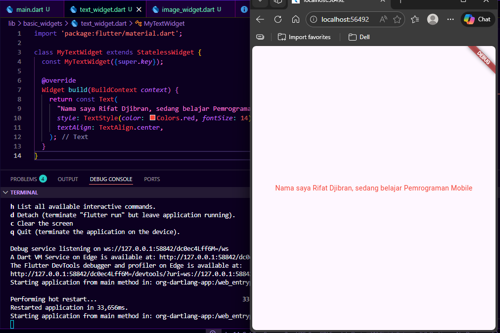

---

## Langkah 2: Image Widget

Pada langkah ini saya mempelajari penggunaan Image Widget untuk menampilkan gambar dari asset. Saya menambahkan gambar ke dalam folder assets dan menghubungkannya melalui file pubspec.yaml.

Saya memahami bahwa tanpa registrasi di pubspec.yaml, gambar tidak akan bisa ditampilkan.

### Hasil
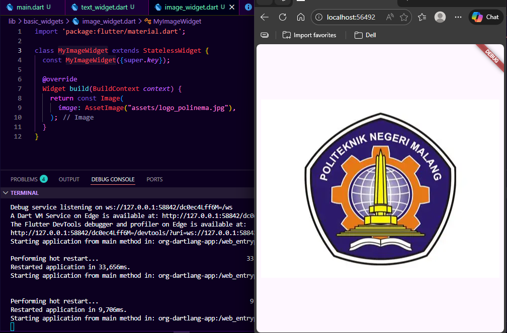

---

# Praktikum 5: Widget Material & Cupertino

## Langkah 1: Cupertino Button dan Loading

Pada langkah ini saya mencoba widget dari Cupertino yang biasanya digunakan untuk desain iOS. Saya menggunakan CupertinoButton dan CupertinoActivityIndicator.

Saya memahami bahwa Flutter mendukung multi-platform design (Android & iOS).

### Hasil
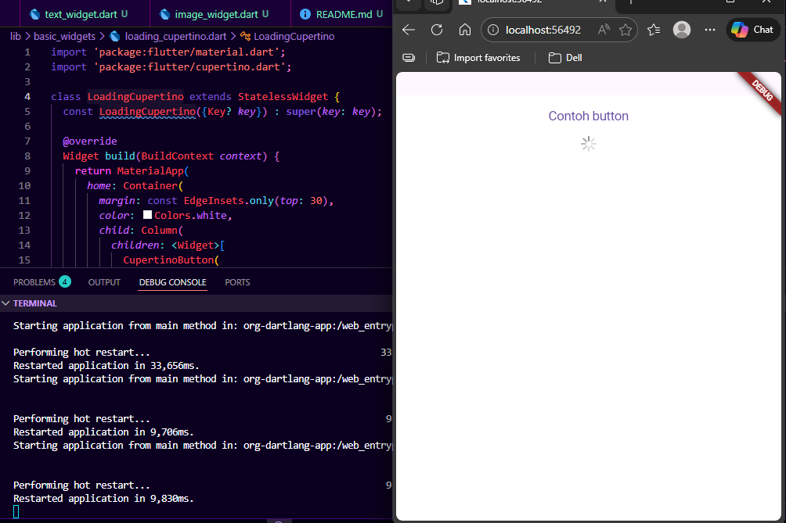

---

## Langkah 2: Floating Action Button (FAB)

Pada langkah ini saya menggunakan FloatingActionButton yang biasanya digunakan sebagai tombol aksi utama dalam aplikasi.

Saya memahami bahwa FAB biasanya digunakan untuk aksi penting seperti tambah data.

### Hasil
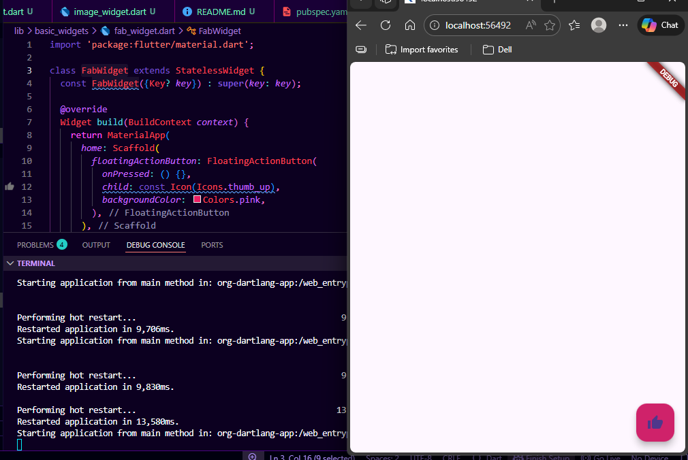

---

## Langkah 3: Scaffold Widget

Pada langkah ini saya menggunakan Scaffold sebagai struktur utama aplikasi. Di dalamnya terdapat AppBar, body, BottomAppBar, dan FloatingActionButton.

Saya memahami bahwa Scaffold adalah kerangka dasar untuk membuat tampilan aplikasi Flutter.

### Hasil

#### Sebelum tombol ditekan
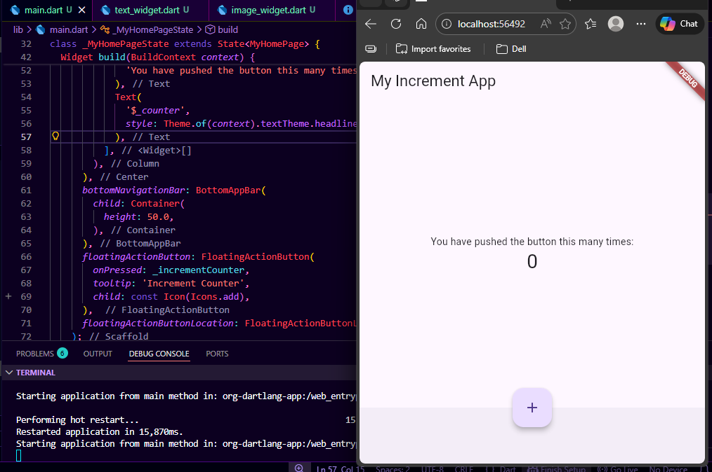

#### Setelah tombol ditekan
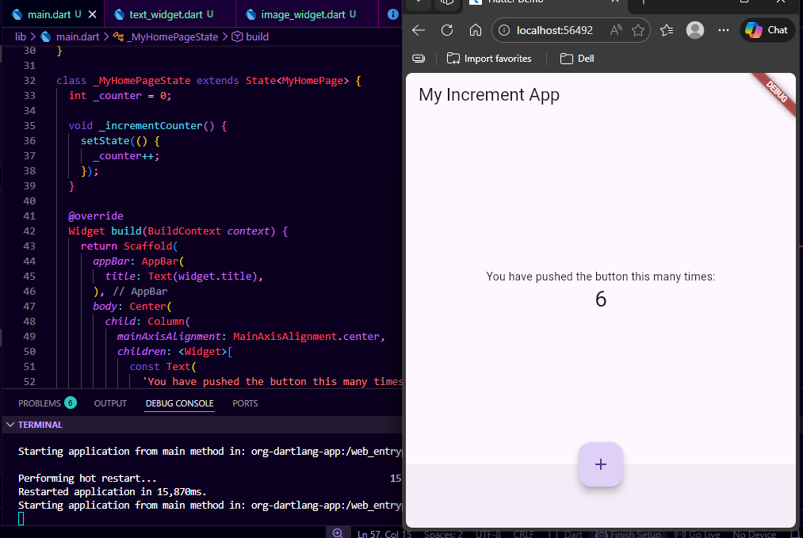
---

## Langkah 4: Dialog Widget

Pada langkah ini saya membuat AlertDialog yang muncul ketika tombol ditekan.

Saya memahami bahwa dialog digunakan untuk memberikan informasi atau konfirmasi kepada user.

### Hasil

#### Sebelum tombol ditekan
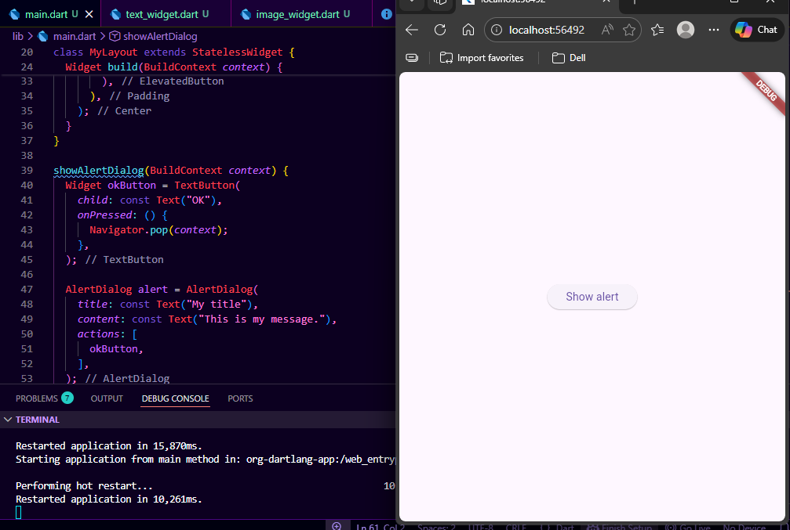

#### Setelah tombol ditekan
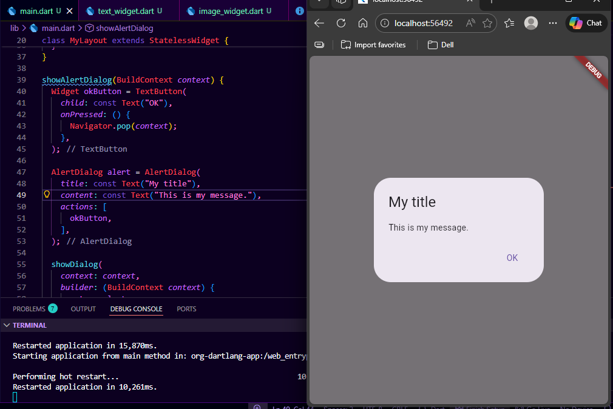

---

## Langkah 5: Input Widget (TextField)

Pada langkah ini saya menggunakan TextField untuk menerima input dari user.

Saya memahami bahwa TextField digunakan untuk form input seperti nama, email, dll.

### Hasil

#### Sebelum input
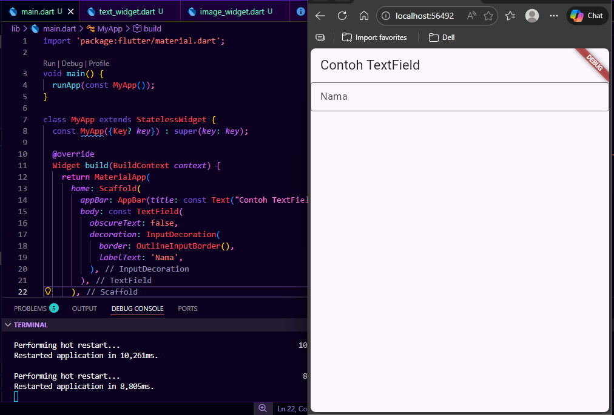

#### Setelah input
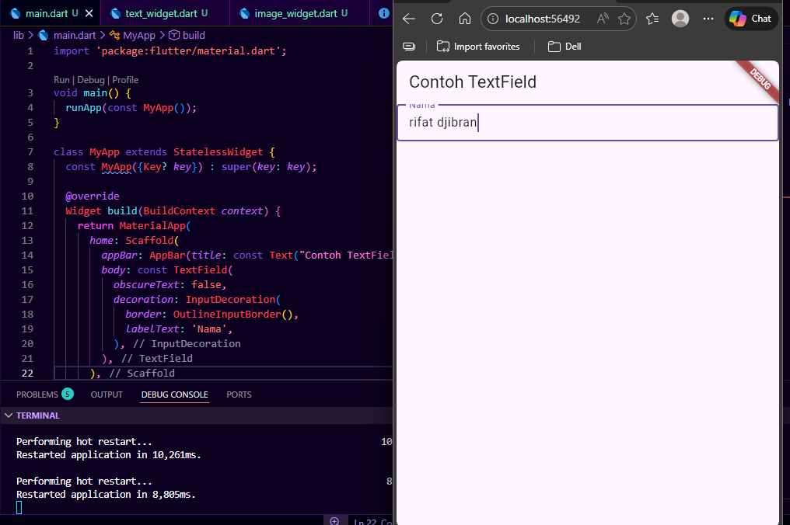

---

## Langkah 6: Date Picker

Pada langkah ini saya membuat fitur pemilihan tanggal menggunakan Date Picker.

Saya memahami bahwa Date Picker memudahkan user dalam memilih tanggal tanpa harus mengetik manual.
penggunaan asynchronous digunakan untuk menunggu input dari user, serta setState untuk memperbarui tampilan setelah tanggal dipilih.

### Hasil
#### Sebelum memilih tanggal
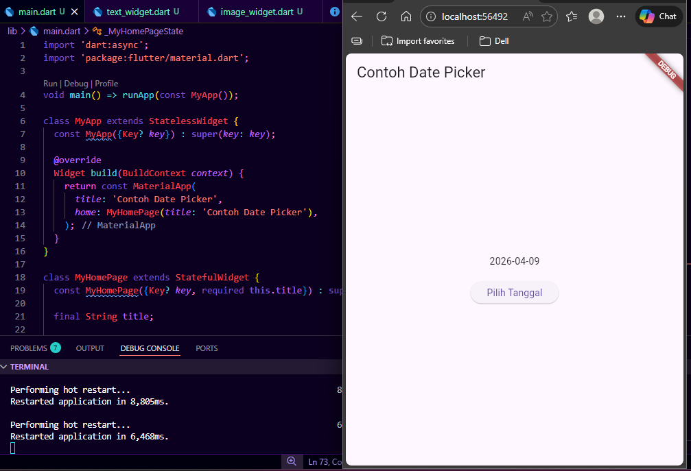

#### Saat memilih tanggal
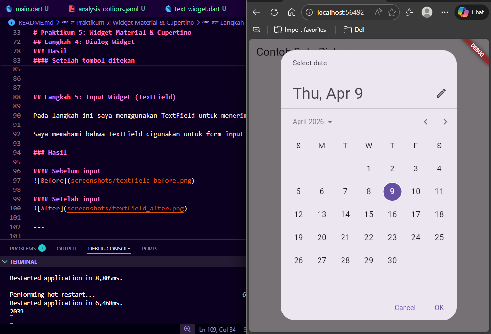

#### Setelah memilih tanggal
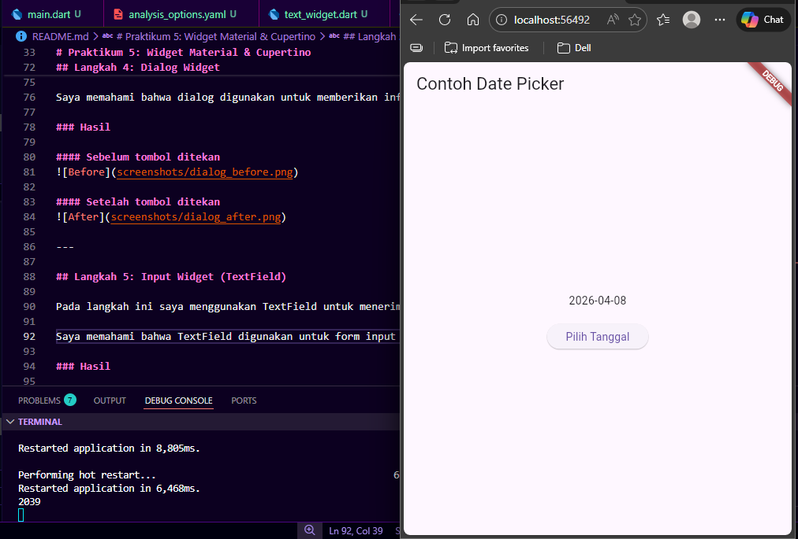

---