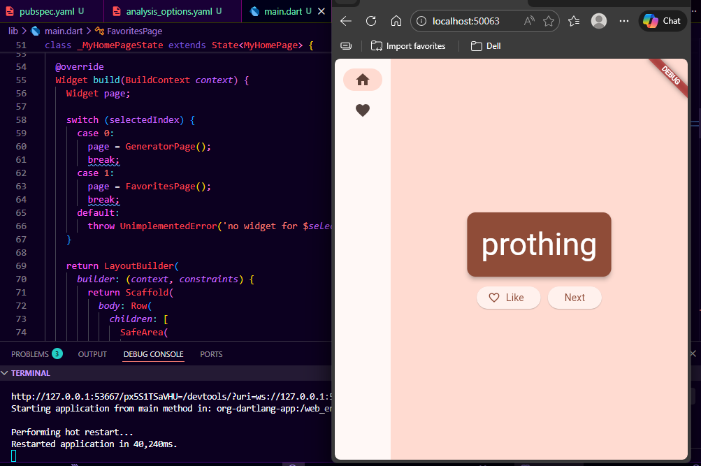
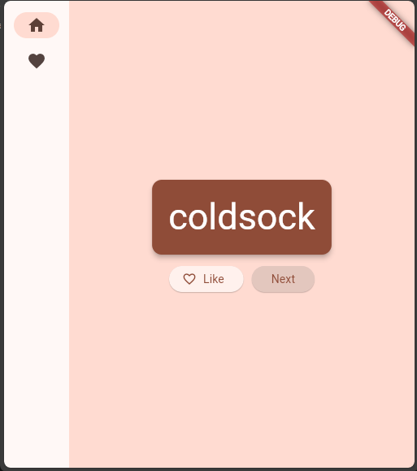
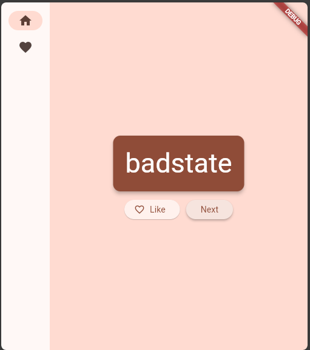
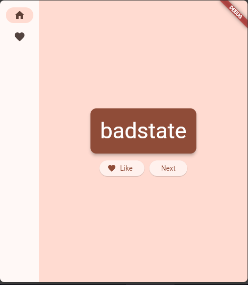
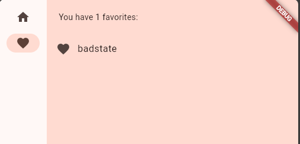
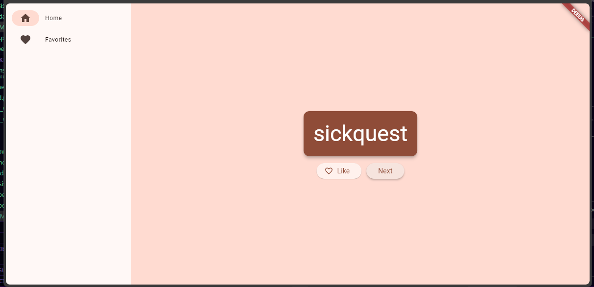

# Tugas Praktikum 

## Identitas

Nama: Rifat Djibran
Project: tugas_praktikum

---

# Deskripsi

Pada tugas praktikum ini saya membuat aplikasi Flutter bernama **Namer App** yang dapat menghasilkan kombinasi kata secara acak menggunakan package `english_words`. Aplikasi ini juga memiliki fitur untuk menyimpan kata favorit serta navigasi antar halaman.

---

# Langkah 1: Konfigurasi Project

Pada langkah ini saya melakukan konfigurasi awal project dengan mengubah file `pubspec.yaml` dan `analysis_options.yaml`.

Saya menambahkan dependency:

* `english_words`
* `provider`

Saya memahami bahwa dependency digunakan untuk menambahkan fitur tambahan ke dalam aplikasi Flutter.

---

# Langkah 2: Menampilkan Random Word

Pada langkah ini saya menampilkan kombinasi dua kata secara acak menggunakan `WordPair.random()`.

Hasilnya ditampilkan menggunakan widget Text.

Saya memahami bahwa package `english_words` dapat menghasilkan kombinasi kata secara otomatis.

## Hasil

---

# Langkah 3: Menambahkan Button Next

Pada langkah ini saya menambahkan tombol **Next** untuk menghasilkan kata baru.

Saya membuat method `getNext()` yang akan mengganti kata sebelumnya dan memanggil `notifyListeners()` agar UI ter-update.

Saya memahami bahwa perubahan state harus diberitahukan agar tampilan ikut berubah.

## Hasil

Before:

After:

---

# Langkah 4: Menambahkan Fitur Like (Favorite)

Pada langkah ini saya menambahkan tombol **Like** untuk menyimpan kata favorit.

Saya membuat list `favorites` dan method `toggleFavorite()` untuk menambah atau menghapus data.

Saya memahami bahwa state dapat digunakan untuk menyimpan data sementara dalam aplikasi.

## Hasil

---

# Langkah 5: Membuat Tampilan dengan Card dan Theme

Pada langkah ini saya memperbaiki tampilan UI dengan menggunakan:

* Card
* Padding
* Theme

Saya memahami bahwa Flutter menggunakan konsep widget composition untuk membangun tampilan.

## Hasil

---

# Langkah 6: Navigation Rail

Pada langkah ini saya membuat navigasi antar halaman menggunakan NavigationRail.

Terdapat dua halaman:

* Home
* Favorites

Saya memahami bahwa NavigationRail digunakan untuk navigasi terutama pada layar lebar.

## Hasil

---

# Langkah 7: Halaman Favorites

Pada langkah ini saya membuat halaman baru untuk menampilkan daftar kata favorit.

Saya menggunakan ListView dan ListTile untuk menampilkan data.

Saya memahami bahwa ListView digunakan untuk menampilkan data dalam bentuk list yang bisa di-scroll.

## Hasil

---

# Langkah 8: Responsive Layout

Pada langkah ini saya menggunakan LayoutBuilder untuk membuat tampilan responsif.

NavigationRail akan otomatis berubah menjadi extended jika ukuran layar lebih besar.

Saya memahami bahwa responsive design penting agar aplikasi bisa berjalan di berbagai ukuran layar.

## Hasil

---

# Kesimpulan

Dari tugas praktikum ini saya memahami:

* Penggunaan Provider sebagai state management
* Pembuatan UI interaktif dengan Flutter
* Penggunaan NavigationRail untuk navigasi
* Penerapan responsive design

Aplikasi ini masih dapat dikembangkan lebih lanjut dengan menambahkan fitur tambahan seperti database atau animasi.

---
