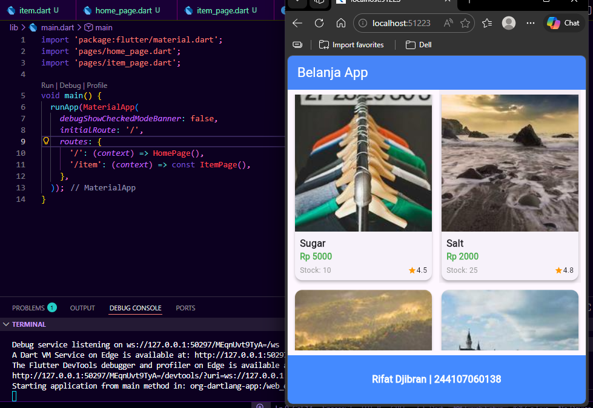

# Pemrograman Mobile

## Identitas
- **Nama:** Rifat Djibran
- **NIM:** 244107060138
- **Project:** `belanja`

---

# Praktikum 5 & Tugas: Membangun Navigasi di Flutter

## Pemahaman Logic & Alur Pengerjaan

Dari pemahamanku selama mengerjakan praktikum dan tugas akhir ini, alur navigasi dan pengiriman data antar halaman di Flutter bisa dieksekusi dengan rapi melalui beberapa tahapan berikut:

**1. Setup & Konfigurasi Routing (main.dart)**
Langkah pertama yang aku lakukan adalah merapikan struktur folder menjadi `pages/` dan `models/` agar *codebase* lebih modular dan gampang di-*maintain*. Di dalam `main.dart`, aku mendaftarkan *Named Routes* (`/` untuk `HomePage` dan `/item` untuk `ItemPage`). Konsep ini mirip dengan *routing* pada web, di mana kita punya *dictionary* rute terpusat untuk mengatur perpindahan layar.

**2. Pemodelan Data Dinamis (item.dart)**
Untuk kebutuhan data *dummy*, aku membuat *blueprint* berupa *class* `Item`. Supaya aplikasinya terasa seperti aplikasi *marketplace* sungguhan (sesuai instruksi tugas), aku memperluas atributnya. Tidak hanya `name` dan `price`, tapi aku juga menambahkan `imageUrl`, `stock`, dan `rating`.

**3. Implementasi GridView & Pengiriman Arguments (HomePage)**
Tampilan utama aku rombak total. *Widget* `ListView` aku ganti dengan `GridView.builder` agar tampilan produk lebih modern. Setiap *card* produk aku bungkus dengan *widget* `InkWell`. Saat *card* ditekan, aplikasi memanggil `Navigator.pushNamed` untuk pindah ke rute `/item`. Di sinilah pengiriman data terjadi: *object* `Item` dari produk yang dipilih dilempar ke halaman selanjutnya melalui parameter `arguments`. Sebagai tambahan identitas, aku memasang `BottomAppBar` di bagian paling bawah untuk menampilkan Nama dan NIM.

**4. Penerimaan Data & Hero Animation (ItemPage)**
Pada halaman detail, data produk yang dilempar dari `HomePage` ditangkap menggunakan `ModalRoute.of(context)!.settings.arguments as Item`. Dari situ, UI akan me-render informasi sesuai dengan barang yang di-klik. 

Untuk meningkatkan *User Experience* (UX), aku mengimplementasikan **Hero Animation**. Gambar pada `HomePage` dan `ItemPage` aku bungkus dengan *widget* `Hero` menggunakan *tag* dinamis yang sama persis (misal: `item_image_${item.name}`). Hasilnya, ketika terjadi perpindahan halaman, gambar seolah-olah melayang dan membesar mengisi layar dengan transisi yang sangat mulus.

---

## Hasil Akhir Aplikasi

Berikut adalah hasil akhir dari aplikasi Belanja yang mengimplementasikan GridView Layout, integrasi pengiriman *arguments*, fitur *Hero Animation*, serta identitas mahasiswa pada bagian *footer*.

*(Tampilan Home GridView & Tampilan Detail)*

