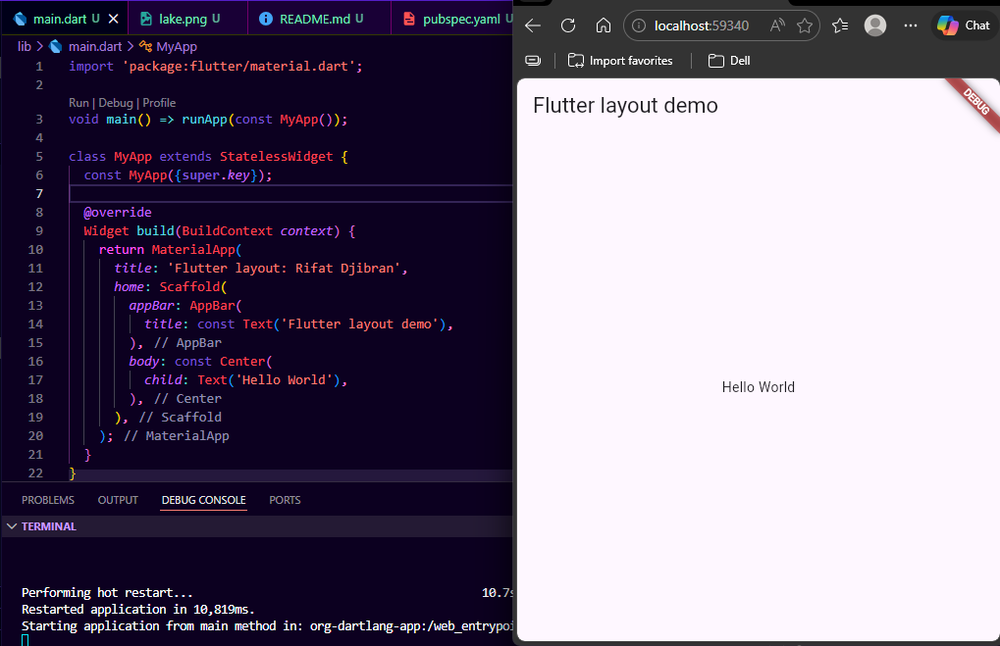
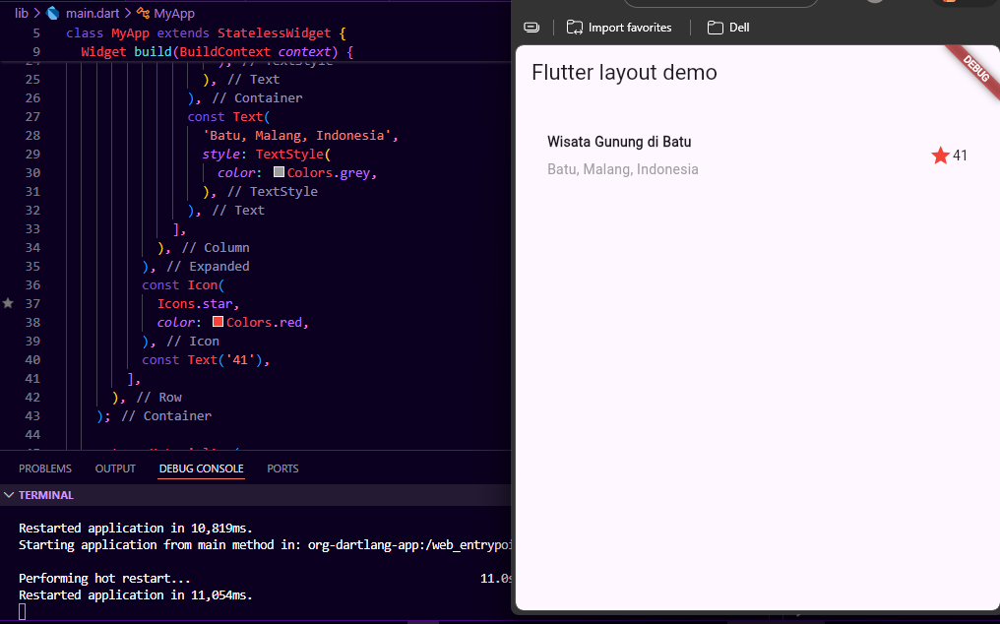
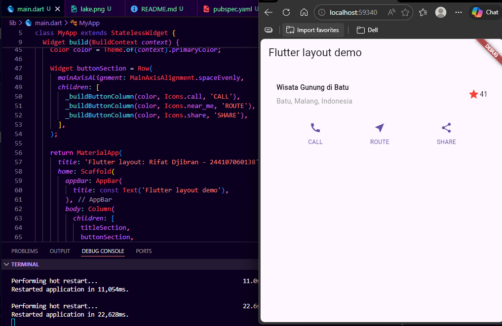
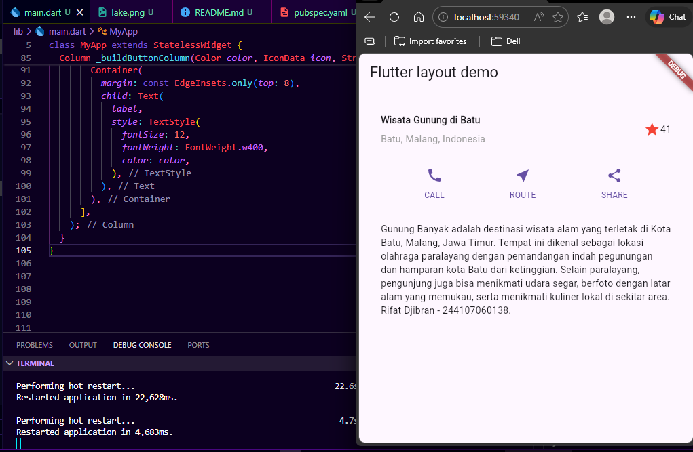
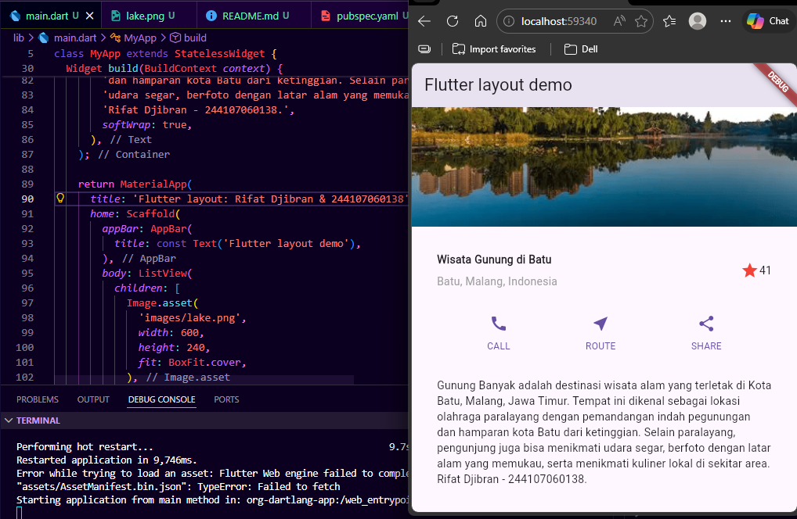

# Pemrograman Mobile

## Identitas
- **Nama:** Rifat Djibran
- **NIM:** 244107060138
- **Project:** `basic_layout_flutter`

---

# Praktikum 1: Konsep Layout di Flutter

## Langkah 1: Membuat Project dan Struktur Dasar

Pada langkah ini saya membuat project Flutter baru bernama `basic_layout_flutter`.
Saya memahami bahwa di Flutter, hampir semua elemen tampilan adalah widget — mulai dari
teks, ikon, hingga struktur tata letak seperti Row, Column, dan Container.
Sebagai titik awal, saya mengisi `main.dart` dengan `MaterialApp` dan `Scaffold`,
lalu menampilkan teks "Hello World" di tengah layar.

### Hasil

---

## Langkah 4: Implementasi Title Row

Pada langkah ini saya menambahkan `titleSection` yang berisi Row dengan tiga elemen:
kolom teks (nama wisata + lokasi), ikon bintang berwarna merah, dan teks angka "41".
Kolom teks dibungkus `Expanded` agar menyesuaikan sisa ruang, dan teks lokasi diberi
warna abu-abu.

### Hasil

---

# Praktikum 2: Implementasi Button Row

## Langkah 1 & 2: Membuat Widget Button Section

Saya membuat method `_buildButtonColumn()` yang menerima parameter warna, ikon, dan
label teks. Method ini mengembalikan Column berisi Icon di atas Text. Kemudian
`buttonSection` dibuat sebagai Row dengan tiga kolom (CALL, ROUTE, SHARE) yang
disejajarkan menggunakan `MainAxisAlignment.spaceEvenly`.

### Hasil

---

# Praktikum 3: Implementasi Text Section

## Langkah 1 & 2: Menambahkan Deskripsi Teks

Saya menambahkan `textSection` berupa Container dengan padding 32 di semua sisi,
berisi teks deskripsi tempat wisata Gunung Banyak di Batu, Malang.
`softWrap: true` memastikan teks membungkus baris secara otomatis.

### Hasil

---

# Praktikum 4: Implementasi Image Section

## Langkah 1 & 2: Menambahkan Gambar

Saya menyiapkan gambar wisata gunung, memasukkannya ke folder `images/`, dan
mendaftarkannya di `pubspec.yaml`. Gambar ditambahkan sebagai elemen pertama
di dalam body menggunakan `Image.asset` dengan `BoxFit.cover`.

### Hasil

---

## Langkah 3: Mengubah Column Menjadi ListView

Pada langkah terakhir, `Column` diganti dengan `ListView` agar tampilan mendukung
scroll dinamis ketika dijalankan di perangkat dengan layar kecil.
