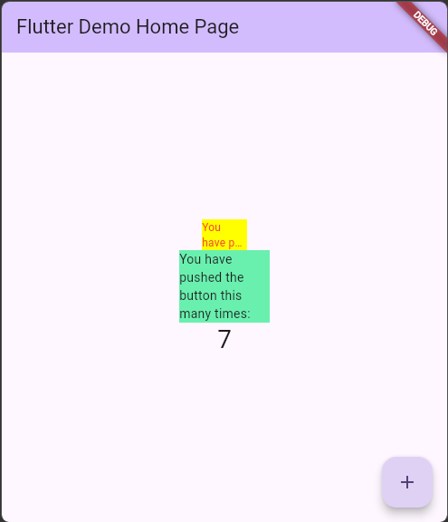
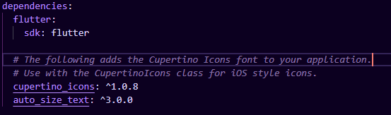
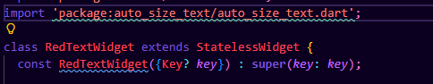

# Pemrograman Mobile Praktikum 7 - Manajemen Plugin

## Identitas
- **Nama:** Rifat Djibran
- **NIM:** 244107060138
- **Project:** `flutter_plugin_pubdev`

---

# Praktikum: Menerapkan Plugin di Project Flutter

## Tujuan Visual

---

## Langkah-langkah Praktikum

### Langkah 2 - Menambahkan Plugin
Perintah `flutter pub add auto_size_text` digunakan untuk menambahkan plugin `auto_size_text` ke dalam project. Perintah ini secara otomatis menambahkan dependensi di `pubspec.yaml` dan menjalankan `flutter pub get`.

### Langkah 4 - Error AutoSizeText
Setelah menambahkan `AutoSizeText`, muncul error karena variabel `text` belum dideklarasikan sebagai properti class. Widget membutuhkan variabel `text` sebagai sumber data teks yang akan ditampilkan.

### Langkah 5 - Variabel & Constructor
Langkah 5 menambahkan `final String text` sebagai properti class dan `required this.text` pada constructor. Ini memungkinkan widget menerima nilai teks dari luar (parent widget) sehingga `RedTextWidget` menjadi reusable.

### Langkah 6 - Dua Widget di main.dart
**Widget 1 - Container kuning (lebar 50):**
Menggunakan `RedTextWidget` dengan `AutoSizeText`. Teks dipaksakan masuk ke lebar 50px, sehingga font otomatis mengecil dan teks terpotong dengan ellipsis (...).

**Widget 2 - Container hijau (lebar 100):**
Menggunakan `Text` biasa (bawaan Flutter). Teks tidak menyesuaikan ukuran, sehingga bisa overflow keluar dari container.

**Perbedaan utama:** `AutoSizeText` secara otomatis menyesuaikan ukuran font agar muat dalam batas yang diberikan, sedangkan `Text` biasa tidak.

---

## Parameter Plugin auto_size_text

| Parameter | Fungsi |
|-----------|--------|
| `text` | String teks yang ditampilkan |
| `style` | Styling teks (warna, ukuran awal, dll) |
| `maxLines` | Maksimal jumlah baris yang diizinkan |
| `overflow` | Perilaku saat teks melebihi batas (ellipsis, clip, dll) |
| `minFontSize` | Ukuran font minimum saat auto-resize |
| `maxFontSize` | Ukuran font maksimum |
| `stepGranularity` | Langkah pengecilan font saat resize |
| `presetFontSizes` | Daftar ukuran font yang boleh digunakan |s