# Pemrograman Mobile
## Praktikum 9 - Kamera

---

## Identitas

| Field    | Detail               |
|----------|----------------------|
| **Nama** | Rifat Djibran        |
| **NIM**  | 244107060138         |
| **Praktikum 1** | kamera_flutter  |
| **Praktikum 2** | photo_filter_carousel |
| **Tugas Praktikum** | kamera_filter |

---

## Praktikum 1: Mengambil Foto dengan Kamera di Flutter

**Project:** `kamera_flutter`

### Tujuan Visual

> Screenshot hasil run aplikasi kamera (Langkah 9) diletakkan di sini setelah deploy ke device.

---

### Langkah-langkah Praktikum

---

### Langkah 1 — Buat Project Baru

Project Flutter baru dibuat dengan nama `kamera_flutter` menggunakan perintah berikut di terminal:

```bash
flutter create kamera_flutter
```

Struktur folder project mengikuti standar Flutter dengan folder `lib/` sebagai tempat utama kode Dart, dan `lib/widget/` sebagai tempat menyimpan widget-widget yang dibuat terpisah.

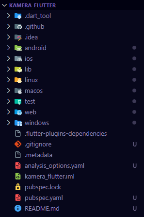
---

### Langkah 2 — Tambah Dependensi yang Diperlukan


Tiga plugin ditambahkan sekaligus menggunakan perintah:

```bash
flutter pub add camera path_provider path
```

- **camera** → plugin utama untuk mengakses dan mengontrol kamera device.
- **path_provider** → menyediakan lokasi direktori penyimpanan yang sesuai platform (Android/iOS).
- **path** → utility untuk membangun path file secara cross-platform.

Hasil penambahan dependensi otomatis tercermin di `pubspec.yaml`:

```yaml
dependencies:
  flutter:
    sdk: flutter
  cupertino_icons: ^1.0.8
  camera: ^0.12.0+1
  path_provider: ^2.1.5
  path: ^1.9.1
```

Untuk Android, nilai `minSdkVersion` pada file `android/app/build.gradle` diubah menjadi minimal `21`:

```gradle
minSdkVersion 21
```

---

### Langkah 3 — Ambil Sensor Kamera dari Device

`void main()` diubah menjadi `async function` agar bisa menggunakan `await`. Plugin kamera membutuhkan `WidgetsFlutterBinding.ensureInitialized()` dipanggil terlebih dahulu sebelum `availableCameras()`, karena plugin menggunakan platform channel yang harus siap sebelum `runApp()`.

**`lib/main.dart`**
```dart
// [Langkah 3]
Future<void> main() async {
  WidgetsFlutterBinding.ensureInitialized();

  final cameras = await availableCameras();
  final firstCamera = cameras.first;

  // ... (Langkah 8)
}
```

---

### Langkah 4 — Buat dan Inisialisasi CameraController

File baru `lib/widget/takepicture_screen.dart` dibuat. Di sinilah `CameraController` dibuat dan diinisialisasi. Controller ini yang menjembatani Flutter dengan hardware kamera di device — tanpa inisialisasi yang benar, kamera tidak bisa menampilkan preview maupun mengambil gambar.

Method `initState()` digunakan untuk membuat controller karena harus dijalankan satu kali saat widget pertama kali dibuat. Method `dispose()` membersihkan resource kamera agar tidak terjadi memory leak.

**`lib/widget/takepicture_screen.dart`**
```dart
// [Langkah 4]
class TakePictureScreen extends StatefulWidget {
  const TakePictureScreen({super.key, required this.camera});
  final CameraDescription camera;

  @override
  TakePictureScreenState createState() => TakePictureScreenState();
}

class TakePictureScreenState extends State<TakePictureScreen> {
  late CameraController _controller;
  late Future<void> _initializeControllerFuture;

  @override
  void initState() {
    super.initState();
    _controller = CameraController(widget.camera, ResolutionPreset.medium);
    _initializeControllerFuture = _controller.initialize();
  }

  @override
  void dispose() {
    _controller.dispose();
    super.dispose();
  }

  @override
  Widget build(BuildContext context) {
    return Container(); // diisi pada langkah berikutnya
  }
}
```

---

### Langkah 5 — Gunakan CameraPreview untuk Menampilkan Preview Foto

`FutureBuilder` digunakan karena inisialisasi kamera bersifat async — kita tidak bisa langsung menampilkan preview sebelum controller benar-benar siap. `FutureBuilder` menangani tiga kondisi: loading, selesai, dan error, sehingga tampilan tidak kosong saat kamera masih menyiapkan diri.

**`lib/widget/takepicture_screen.dart`** (bagian `build`)
```dart
// [Langkah 5]
body: FutureBuilder<void>(
  future: _initializeControllerFuture,
  builder: (context, snapshot) {
    if (snapshot.connectionState == ConnectionState.done) {
      return CameraPreview(_controller); // tampilkan preview kamera
    } else {
      return const Center(child: CircularProgressIndicator()); // loading
    }
  },
),
```

---

### Langkah 6 — Ambil Foto dengan CameraController


`FloatingActionButton` ditambahkan sebagai tombol trigger pengambilan foto. Method `takePicture()` bersifat async dan mengembalikan `XFile` yang berisi path file gambar yang tersimpan di cache device. Blok `try/catch` digunakan untuk menangkap error apapun yang mungkin terjadi, misalnya kamera sedang digunakan aplikasi lain.

**`lib/widget/takepicture_screen.dart`** (bagian `floatingActionButton`)
```dart
// [Langkah 6]
floatingActionButton: FloatingActionButton(
  onPressed: () async {
    try {
      await _initializeControllerFuture;
      final image = await _controller.takePicture();
    } catch (e) {
      print(e);
    }
  },
  child: const Icon(Icons.camera_alt),
),
```

---

### Langkah 7 — Buat Widget Baru DisplayPictureScreen

File baru `lib/widget/displaypicture_screen.dart` dibuat. Widget ini menerima `imagePath` (String) yang kemudian digunakan oleh `Image.file()` untuk membaca dan menampilkan foto langsung dari penyimpanan lokal device. Widget ini bersifat `StatelessWidget` karena hanya menampilkan data tanpa perlu mengubah state.

**`lib/widget/displaypicture_screen.dart`**
```dart
// [Langkah 7]
import 'dart:io';
import 'package:flutter/material.dart';

class DisplayPictureScreen extends StatelessWidget {
  final String imagePath;

  const DisplayPictureScreen({super.key, required this.imagePath});

  @override
  Widget build(BuildContext context) {
    return Scaffold(
      appBar: AppBar(title: const Text('Display the Picture - 244107060138')),
      body: Image.file(File(imagePath)),
    );
  }
}
```

---

### Langkah 8 — Edit main.dart

`runApp()` diisi dengan `TakePictureScreen` dan meneruskan `firstCamera` yang sudah didapat dari Langkah 3. `ThemeData.dark()` digunakan agar tampilan aplikasi kamera terasa lebih natural dengan latar gelap.

**`lib/main.dart`** (lengkap)
```dart
import 'package:camera/camera.dart';
import 'package:flutter/material.dart';
import 'widget/takepicture_screen.dart';

Future<void> main() async {
  // [Langkah 3]
  WidgetsFlutterBinding.ensureInitialized();
  final cameras = await availableCameras();
  final firstCamera = cameras.first;

  // [Langkah 8]
  runApp(
    MaterialApp(
      theme: ThemeData.dark(),
      home: TakePictureScreen(camera: firstCamera),
      debugShowCheckedModeBanner: false,
    ),
  );
}
```

---

### Langkah 9 — Menampilkan Hasil Foto

> Ambil screenshot: (1) tampilan preview kamera, (2) tampilan foto setelah diambil.

```
screenshots/p1_camera_preview.jpg  → tampilan CameraPreview saat aplikasi dibuka
screenshots/p1_display_picture.jpg → tampilan foto setelah tombol kamera ditekan
```

Kode navigasi ditambahkan di dalam blok `try` setelah `takePicture()`. `context.mounted` dicek terlebih dahulu sebelum navigasi karena operasi async bisa jadi selesai setelah widget sudah dihapus dari tree, yang akan menyebabkan error.

**`lib/widget/takepicture_screen.dart`** (update blok try/catch)
```dart
try {
  // [Langkah 9]
  await _initializeControllerFuture;
  final image = await _controller.takePicture();

  if (!context.mounted) return;

  await Navigator.of(context).push(
    MaterialPageRoute(
      builder: (context) => DisplayPictureScreen(
        imagePath: image.path,
      ),
    ),
  );
} catch (e) {
  print(e);
}
```

**Hasil:**

| Camera Preview | Display Picture |
|:-:|:-:|
| 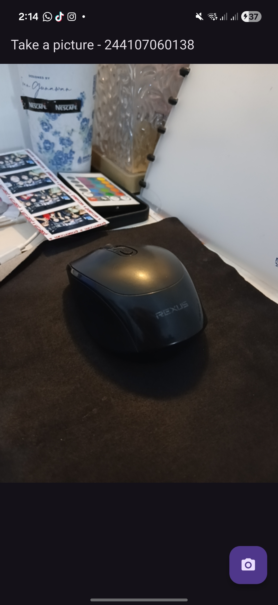 | 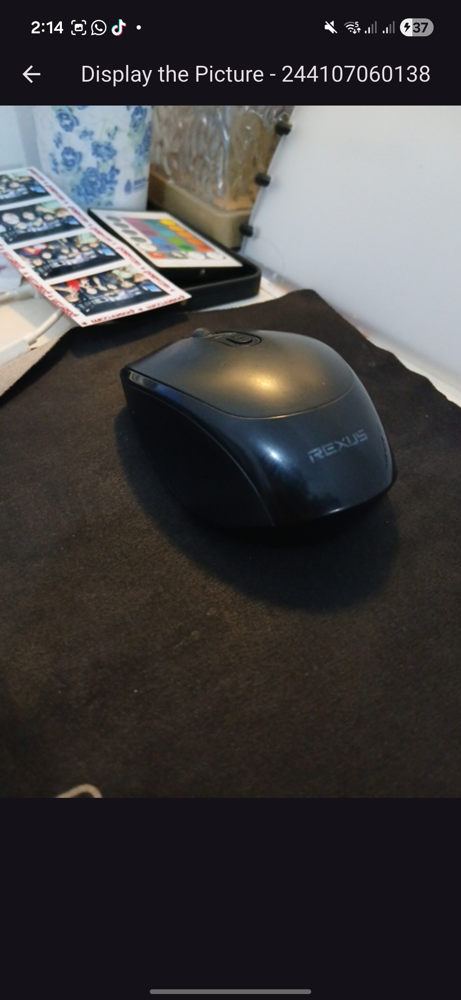 |

---
---

## Praktikum 2: Membuat Photo Filter Carousel

**Project:** `photo_filter_carousel`

### Tujuan Visual

> Screenshot hasil run aplikasi filter carousel (Langkah 6) diletakkan di sini setelah deploy ke device.

---

### Langkah-langkah Praktikum

---

### Langkah 1 — Buat Project Baru

Project Flutter baru dibuat dengan nama `photo_filter_carousel`:

```bash
flutter create photo_filter_carousel
```

Di dalam `lib/`, folder `widget/` dibuat untuk menampung semua widget yang akan dibuat secara terpisah agar kode lebih modular dan mudah dipelihara.

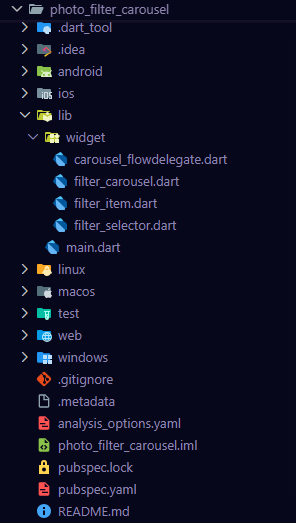

---

### Langkah 2 — Buat Widget Selector Ring dan Dark Gradient

File `lib/widget/filter_selector.dart` dibuat. Widget ini bertanggung jawab atas tampilan carousel filter di bagian bawah layar, mencakup tiga elemen yang ditumpuk lewat `Stack`:

1. **Dark gradient** — latar gelap dari transparan ke hitam agar filter terlihat jelas.
2. **Carousel items** — deretan lingkaran filter yang bisa digeser, dirender dengan `Flow` dan `CarouselFlowDelegate`.
3. **Selection ring** — lingkaran putih di tengah sebagai penanda filter yang sedang aktif.

`PageController` dengan `viewportFraction` kecil digunakan untuk efek carousel di mana beberapa item sekaligus terlihat dalam satu layar.

**`lib/widget/filter_selector.dart`** (struktur utama)
```dart
// [Langkah 2]
@immutable
class FilterSelector extends StatefulWidget {
  const FilterSelector({
    super.key,
    required this.filters,
    required this.onFilterChanged,
    this.padding = const EdgeInsets.symmetric(vertical: 24),
  });

  final List<Color> filters;
  final void Function(Color selectedColor) onFilterChanged;
  final EdgeInsets padding;

  @override
  State<FilterSelector> createState() => _FilterSelectorState();
}
```

---

### Langkah 3 — Buat Widget Photo Filter Carousel


File `lib/widget/filter_carousel.dart` dibuat. Widget ini merupakan "parent" yang mengelola state warna filter aktif dan menggabungkan foto dengan `FilterSelector`. `ValueNotifier` digunakan agar update warna filter tidak memicu rebuild seluruh tree — hanya bagian foto yang perlu dirender ulang melalui `ValueListenableBuilder`.

Daftar filter dibangun dari `Colors.primaries` Flutter yang di-shuffle dengan pola tertentu agar warna tersebar merata dan tidak berulang berurutan.

**`lib/widget/filter_carousel.dart`** (struktur utama)
```dart
// [Langkah 3]
class _PhotoFilterCarouselState extends State<PhotoFilterCarousel> {
  final _filters = [
    Colors.white,
    ...List.generate(
      Colors.primaries.length,
      (index) => Colors.primaries[(index * 4) % Colors.primaries.length],
    ),
  ];

  final _filterColor = ValueNotifier<Color>(Colors.white);
  // ...
}
```

---

### Langkah 4 — Membuat Filter Warna (CarouselFlowDelegate)

File `lib/widget/carousel_flowdelegate.dart` dibuat. `FlowDelegate` adalah cara Flutter mengatur layout dan painting children secara manual dengan performa tinggi. Di sini, setiap item filter diberi transformasi berdasarkan jaraknya dari item yang aktif (tengah layar):

- **Skala**: item di tengah berukuran penuh (1.0), item di pinggir menyusut hingga 0.5.
- **Opacity**: item di tengah sepenuhnya terlihat (1.0), item di pinggir memudar hingga 0.25.

Optimasi penting: hanya item yang benar-benar terlihat (±3 dari posisi aktif) yang dirender, bukan semua item sekaligus.

**`lib/widget/carousel_flowdelegate.dart`** (logika utama)
```dart
// [Langkah 4]
final active = viewportOffset.pixels / itemExtent;
final itemScale = 0.5 + (percentFromCenter * 0.5);
final opacity = 0.25 + (percentFromCenter * 0.75);
```

---

### Langkah 5 — Membuat Filter Item

File `lib/widget/filter_item.dart` dibuat. Widget ini merupakan satu lingkaran filter yang menampilkan thumbnail foto dengan warna filter yang di-blend menggunakan `BlendMode.hardLight`. Mode blending ini dipilih karena menghasilkan efek yang terlihat alami — warna cerah menjadi lebih terang dan warna gelap menjadi lebih gelap seperti efek filter foto sungguhan.

**`lib/widget/filter_item.dart`**
```dart
// [Langkah 5]
@immutable
class FilterItem extends StatelessWidget {
  const FilterItem({super.key, required this.color, this.onFilterSelected});

  final Color color;
  final VoidCallback? onFilterSelected;

  @override
  Widget build(BuildContext context) {
    return GestureDetector(
      onTap: onFilterSelected,
      child: AspectRatio(
        aspectRatio: 1.0,
        child: Padding(
          padding: const EdgeInsets.all(8),
          child: ClipOval(
            child: Image.network(
              'https://docs.flutter.dev/cookbook/img-files'
              '/effects/instagram-buttons/millennial-texture.jpg',
              color: color.withOpacity(0.5),
              colorBlendMode: BlendMode.hardLight,
            ),
          ),
        ),
      ),
    );
  }
}
```

---

### Langkah 6 — Implementasi Filter Carousel

> Ambil screenshot: (1) tampilan awal filter putih (default), (2) setelah menggeser ke filter warna lain.

```
screenshots/p2_filter_default.jpg → tampilan awal dengan filter putih
screenshots/p2_filter_colored.jpg → tampilan setelah memilih filter warna
```

`PhotoFilterCarousel` diimpor ke `main.dart` sebagai home widget. Ini langkah terakhir yang menyatukan semua widget yang dibuat di langkah sebelumnya menjadi satu aplikasi yang bisa dijalankan.

**`lib/main.dart`**
```dart
// [Langkah 6]
import 'package:flutter/material.dart';
import 'widget/filter_carousel.dart';

void main() {
  runApp(
    const MaterialApp(
      home: PhotoFilterCarousel(),
      debugShowCheckedModeBanner: false,
    ),
  );
}
```

**Hasil:**

| Filter Default (Putih) | Filter Warna Aktif 1 | Filter Warna Aktif 2 |
|:-:|:-:|:-:|
| 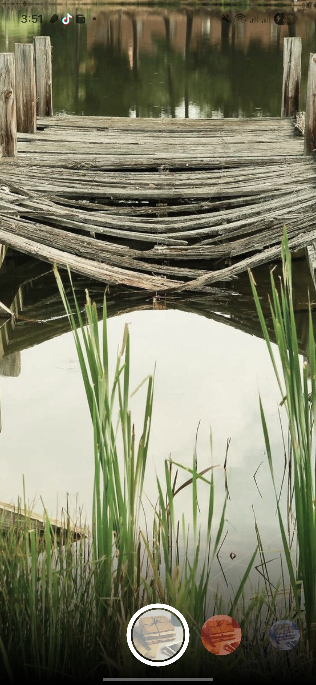 | 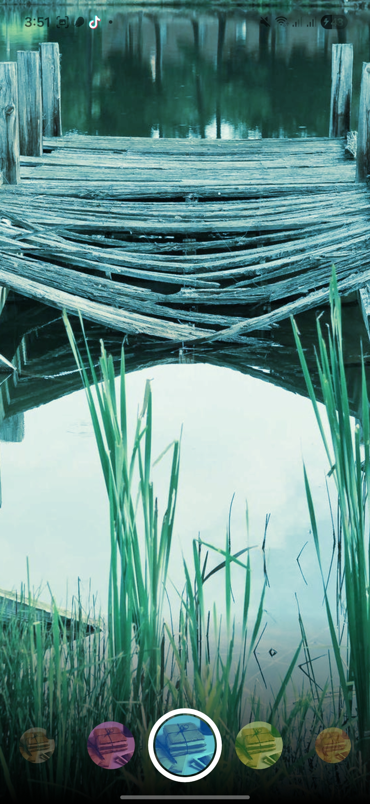 | 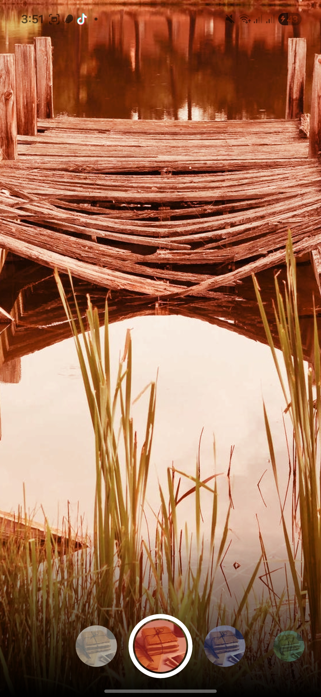 |

---
## Troubleshoot — Praktikum 2

Sebelum aplikasi Praktikum 2 bisa berjalan normal, ditemukan dua error yang perlu diperbaiki terlebih dahulu.

---

### Error 1 — `ViewportOffset` Tidak Dikenali (Garis Merah di VS Code)

**Gejala:** `ViewportOffset` pada parameter `_buildCarousel` di `filter_selector.dart` bergaris merah dan analyzer memunculkan error *"Undefined class 'ViewportOffset'"*.

**Penyebab:** `ViewportOffset` bukan bagian dari `package:flutter/material.dart`. Class ini berada di layer rendering Flutter yang harus diimpor secara eksplisit.

**Solusi:** Tambahkan import `rendering.dart` di bagian atas `filter_selector.dart`:

```dart
import 'package:flutter/material.dart';
import 'package:flutter/rendering.dart'; // ← tambahkan baris ini
import 'carousel_flowdelegate.dart';
import 'filter_item.dart';
```

---

### Error 2 — Black Screen + `Unsupported operation: Infinity or NaN toInt`

**Gejala:** Aplikasi berjalan tapi layar hitam, filter hanya menampilkan tanda `×`, dan di console muncul exception:

```
UnsupportedError: Unsupported operation: Infinity or NaN toInt
CarouselFlowDelegate.paintChildren (carousel_flowdelegate.dart:30)
```

**Penyebab:** Saat pertama kali dirender, widget `Flow` di dalam `Scrollable` belum mendapat ukuran yang valid — `context.size.width` bernilai `0.0`. Akibatnya `itemExtent = size / filtersPerScreen` menghasilkan `0.0`, dan ketika `viewportOffset.pixels` dibagi `0.0` hasilnya adalah `Infinity`. Nilai `Infinity` kemudian dipanggil `.floor().toInt()` yang langsung crash.

**Solusi:** Tambahkan guard di awal method `paintChildren` pada `carousel_flowdelegate.dart` untuk menghentikan eksekusi jika ukuran belum siap:

```dart
@override
void paintChildren(FlowPaintingContext context) {
  final count = context.childCount;
  final size = context.size.width;

  // Guard: hentikan jika ukuran belum siap atau tidak ada item
  if (size <= 0 || count == 0) return;

  final itemExtent = size / filtersPerScreen;

  // Guard: hentikan jika itemExtent tidak valid
  if (itemExtent <= 0) return;

  // ... sisa kode berjalan normal
```

Dengan guard ini, `paintChildren` langsung keluar (`return`) saat ukuran masih `0.0` tanpa memproses apapun, lalu dipanggil ulang secara otomatis oleh Flutter begitu layout selesai dihitung dan ukuran sudah valid.

---

## Kesimpulan

Pada praktikum ini dipelajari dua hal utama:

1. **Plugin Kamera Flutter** — cara menggunakan `CameraController` untuk mengakses hardware kamera, menampilkan preview secara real-time dengan `CameraPreview`, mengambil foto dengan `takePicture()`, dan menampilkan hasilnya menggunakan `Image.file()`.

2. **Photo Filter Carousel** — cara membangun UI carousel yang kompleks menggunakan `Flow` + `FlowDelegate` untuk performa tinggi, `ValueNotifier` untuk state management yang efisien, dan `BlendMode` untuk efek filter warna pada gambar.

## Tugas Praktikum

**Project:** `kamera_filter`

---

### Tugas 1 — Dokumentasi Praktikum 1 & 2

Praktikum 1 dan Praktikum 2 telah diselesaikan dan didokumentasikan lengkap di atas. Setiap langkah dilengkapi penjelasan kode dan screenshot pada langkah yang membutuhkannya. Troubleshoot juga didokumentasikan untuk error yang ditemukan saat pengerjaan Praktikum 2.

---

### Tugas 2 — Gabungan Praktikum 1 + Praktikum 2

Project baru `kamera_filter` dibuat sebagai implementasi gabungan. Setelah mengambil foto menggunakan kamera, pengguna langsung diarahkan ke layar filter carousel untuk memilih filter warna pada foto yang baru saja diambil.


**Struktur file `kamera_filter`:**
```
lib/
├── main.dart
└── widget/
    ├── takepicture_screen.dart      ← dari Praktikum 1
    ├── display_filter_screen.dart   ← widget baru (inti gabungan)
    ├── filter_selector.dart         ← dari Praktikum 2
    ├── carousel_flowdelegate.dart   ← dari Praktikum 2
    └── filter_item.dart             ← dari Praktikum 2
```

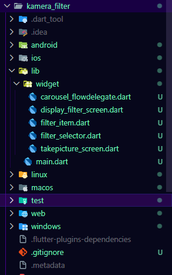

Perubahan utama dari P1 ada di `takepicture_screen.dart` — navigasi setelah foto diambil diarahkan ke `DisplayFilterScreen` (bukan `DisplayPictureScreen`), dan ditambah file baru `display_filter_screen.dart` yang menggabungkan `Image.file()` dari P1 dengan `FilterSelector` dari P2.

**`lib/widget/display_filter_screen.dart`** (file baru — inti gabungan)
```dart
import 'dart:io';
import 'package:flutter/material.dart';
import 'filter_selector.dart';

class DisplayFilterScreen extends StatefulWidget {
  final String imagePath;
  const DisplayFilterScreen({super.key, required this.imagePath});

  @override
  State<DisplayFilterScreen> createState() => _DisplayFilterScreenState();
}

class _DisplayFilterScreenState extends State<DisplayFilterScreen> {
  final _filters = [
    Colors.white,
    ...List.generate(
      Colors.primaries.length,
      (index) => Colors.primaries[(index * 4) % Colors.primaries.length],
    ),
  ];

  final _filterColor = ValueNotifier<Color>(Colors.white);

  void _onFilterChanged(Color value) => _filterColor.value = value;

  @override
  void dispose() {
    _filterColor.dispose();
    super.dispose();
  }

  @override
  Widget build(BuildContext context) {
    return Scaffold(
      appBar: AppBar(
        title: const Text('Filter Foto - 244107060138'),
        backgroundColor: Colors.black,
      ),
      backgroundColor: Colors.black,
      body: Stack(
        children: [
          // Foto hasil jepretan dari P1 dengan filter warna di atasnya
          Positioned.fill(
            child: ValueListenableBuilder<Color>(
              valueListenable: _filterColor,
              builder: (context, color, child) {
                return Image.file(
                  File(widget.imagePath),
                  color: color == Colors.white ? null : color.withOpacity(0.5),
                  colorBlendMode: BlendMode.color,
                  fit: BoxFit.cover,
                );
              },
            ),
          ),
          // FilterSelector dari P2 diletakkan di bagian bawah layar
          Positioned(
            left: 0, right: 0, bottom: 0,
            child: FilterSelector(
              filters: _filters,
              onFilterChanged: _onFilterChanged,
            ),
          ),
        ],
      ),
    );
  }
}
```

**Update `takepicture_screen.dart`** — hanya ganti import dan tujuan navigasi:
```dart
// Sebelumnya menuju DisplayPictureScreen (P1):
import 'displaypicture_screen.dart';
builder: (context) => DisplayPictureScreen(imagePath: image.path),

// Sekarang menuju DisplayFilterScreen (gabungan):
import 'display_filter_screen.dart';
builder: (context) => DisplayFilterScreen(imagePath: image.path),
```

**Hasil:**

| Camera Preview | Filter Carousel Aktif | Filter Warna Dipilih |
|:-:|:-:|:-:|
| 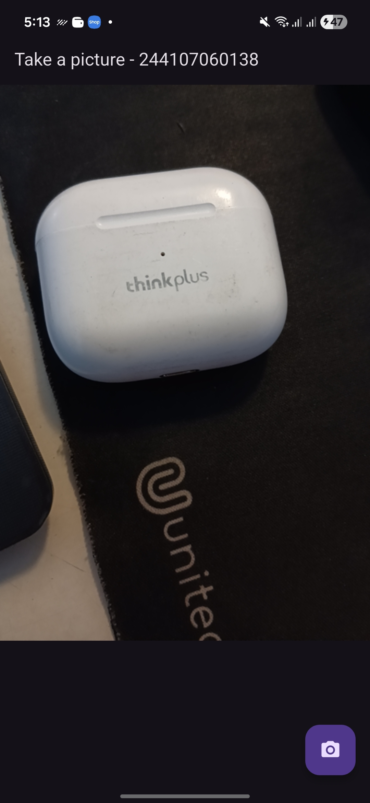 | 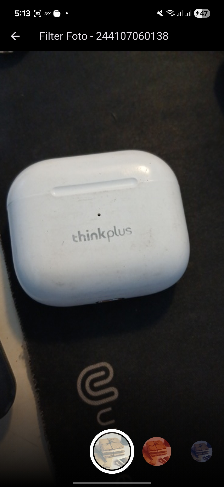 | 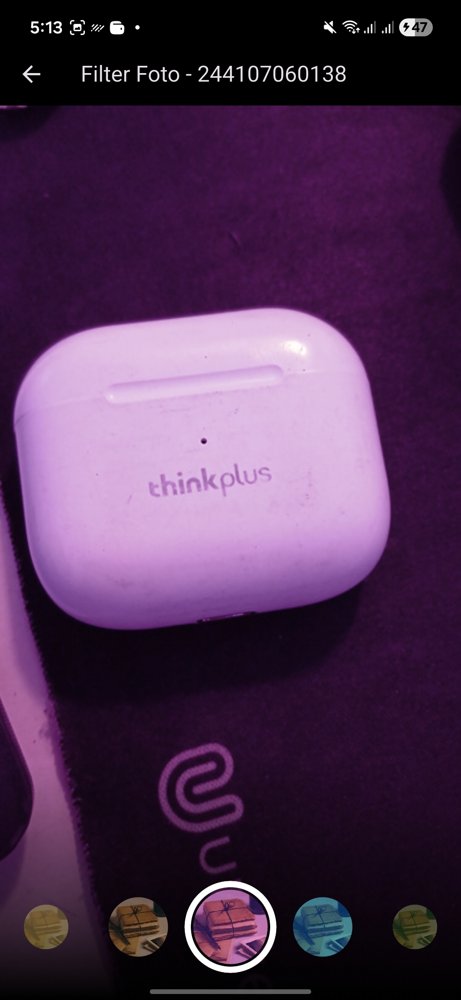 |

---

### Tugas 3 — Jelaskan Maksud `async` pada Praktikum 1

Pada Praktikum 1, `main()` diubah menjadi:

```dart
Future<void> main() async { ... }
```

`async` adalah penanda bahwa sebuah function berjalan secara **asynchronous** — artinya function tersebut tidak memblokir program saat menunggu proses yang butuh waktu. Dengan `async`, keyword `await` bisa digunakan di dalamnya untuk menunggu hasil `availableCameras()` selesai sebelum lanjut ke baris berikutnya.

Ini penting karena `availableCameras()` berkomunikasi dengan hardware kamera melalui platform channel — prosesnya tidak instan. Tanpa `async`/`await`, kode akan terus berjalan ke `runApp()` sebelum daftar kamera selesai didapat, sehingga `firstCamera` kosong dan aplikasi crash.

Return type-nya menjadi `Future<void>` karena setiap `async` function secara otomatis membungkus nilainya dalam `Future` — ini adalah "janji" bahwa function akan selesai di masa depan, meski tidak mengembalikan nilai apapun (`void`).

---

### Tugas 4 — Jelaskan Fungsi `@immutable` dan `@override`

**`@immutable`**

`@immutable` adalah anotasi dari package `meta` (sudah include di Flutter) yang menandai sebuah class bahwa **semua field-nya harus bersifat `final`** — tidak boleh ada nilai yang bisa diubah setelah object dibuat. Dart analyzer akan memunculkan warning jika ada field non-final di class yang diberi anotasi ini.

Pada Praktikum 2, anotasi ini dipakai di widget-widget `StatelessWidget` seperti `FilterItem`:

```dart
@immutable
class FilterItem extends StatelessWidget { ... }
```

Ini sesuai karena `StatelessWidget` memang tidak punya state yang berubah. `@immutable` menegaskan kontrak itu secara eksplisit — siapapun yang membaca kode langsung tahu bahwa object ini aman dipakai ulang atau di-cache antar widget tanpa risiko data berubah di tengah jalan.

---

**`@override`**

`@override` adalah anotasi yang menandai bahwa sebuah method **menimpa method dengan nama yang sama dari class parent**. Di Flutter ini paling sering terlihat pada:

```dart
@override
void initState() { ... }

@override
Widget build(BuildContext context) { ... }

@override
void dispose() { ... }
```

Fungsi utamanya ada dua:

1. **Kejelasan kode** — langsung terlihat bahwa method ini bukan method baru, melainkan implementasi ulang dari method yang sudah ada di parent class (`StatefulWidget`, `StatelessWidget`, `FlowDelegate`, dll).

2. **Proteksi dari typo** — jika nama method salah ketik (misalnya `buid` bukan `build`), Dart analyzer langsung error karena tidak ada method dengan nama itu di parent yang bisa di-override. Tanpa `@override`, typo seperti ini diam-diam membuat method baru dan bugnya sulit ditemukan.
